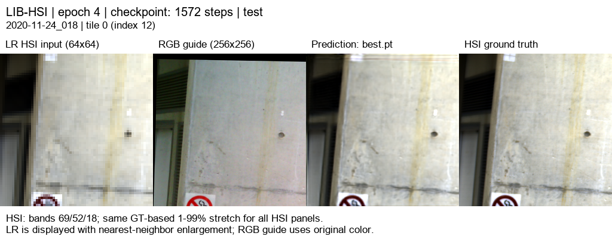

# RGB-HSI-SR

고해상도 RGB의 공간 정보를 활용해 저해상도 HSI를 복원하는 **RGB 유도 HSI 초해상도 연구**입니다. SSA-MRN 기반 모델의 분광 특징, 디코더 구조와 손실 함수를 비교하며 공간·분광 복원 성능을 평가합니다.

| 문서 | 내용 |
|---|---|
| [현재 연구](SSA-MRN/README.md) | RGB11 결과, 해석 및 대표 이미지 |
| [연구 설명](SSA-MRN/docs/research.md) | 17특징·공동 디코더·23탭·LR 일관성·손실 |
| [이전 실험](SSA-MRN/docs/previous_experiments.md) | RGB01~11과 예비실험 |
| [204밴드 웹뷰어](https://biyonghiyon.github.io/RGB-HSI-SR/ssa-mrn/) | RGB11의 고정 5장면 |
| [실행 방법](docs/setup.md) | 환경·데이터 경로·원격 실행 준비 |

## 현재 결과

LIB-HSI 합성 area ×4, 204밴드, train393 / validation45 / test75입니다. RGB11은 RGB07 계열의 구조에 HSI 경계 손실을 더한 추가 학습 실험입니다.

| test75 · 300타일 | MSE ↓ | PSNR dB ↑ | SAM ° ↓ |
|---|---:|---:|---:|
| 23탭 + LR 보정 | 0.0011539606 | 30.0649 | 2.44504 |
| 동일 학습량 대조군 | 0.0004378418 | 34.3916 | 2.15071 |
| RGB11 선택 후보 | 0.0004376169 | 34.3948 | 2.14986 |

대조군 대비 PSNR +0.0032 dB, SAM −0.00085°로 개선 폭은 작습니다. 실제 센서 HR-HSI 정답 평가가 아니며, RGB09보다 평균 MSE는 높습니다. 이전 시험셋을 반복 확인했다는 한계도 유지합니다.



## 코드 받기

```bash
git clone --recurse-submodules https://github.com/BIYONGHIYON/RGB-HSI-SR.git
cd RGB-HSI-SR
```

모델 코드와 실험 보고서는 `SSA-MRN/`에 있습니다. 원본 데이터는 포함하지 않으며, 가중치와 평가 결과의 위치·해시는 각 실험 보고서에서 확인할 수 있습니다.
