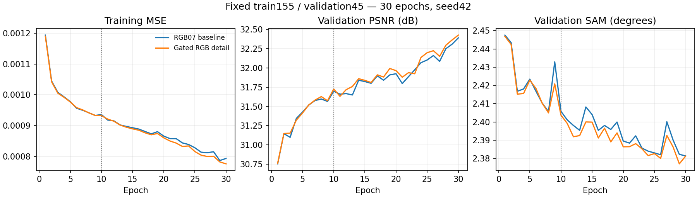

# Pilot 후속 · 원본 대 미세조정 평가와 30에폭 비교

[현재 연구](../../../README.md) · [10에폭 예비실험](pilot_subset155.md)

| 비교 기준 | 이번에 바꾼 점 | 관측된 차이 | 판단 |
|---|---|---|---|
| 앞선 예비실험 | 원본 시작과 미세조정 후속 비교 | validation 결과만 사용 | 후보 선별용이며 test 결과를 생성하지 않았습니다. |

[수치](#3-정량-결과) · [이전 대비](#4-직전-연구와-수치-차이) · [그래프](#5-그래프) · [결과 이미지](#6-결과-이미지-예시)

## 1. 목적과 상태

원본 RGB07 대비 LR1e-5 미세조정의 효과와 RGB 고주파 보정의 지속적인 개선 여부를 확인했습니다. Linux 학과 서버에서 평가 및 두 모델의 11~30에폭 추가 학습을 완료했습니다. 둘 다 exit0, best30입니다. 합성 area ×4의 검증 평가이며 test를 사용하지 않았습니다.

## 2. 변경 사항과 평가 조건

30에폭 비교는 동일 train155 / validation45(180타일), 고정 장면 목록, seed42입니다. 10에폭 latest의 모델·optimizer·RNG 상태를 복원했습니다. HR256/LR64, 204밴드, 17특징, K4, 23탭, 학습률1e-4, 배치4, MSE+0.01(1−cos), 동일 정합·마스크 및 LR 평균 보정을 유지했습니다. A6000에서 두 작업을 동시에 실행했습니다. 추가20에폭은 각각43.24/43.66분입니다.

미세조정 확인에서는 원본 RGB07 best99와 이전 warm_low best5를 같은 validation45·180타일·정합 마스크·LR 평균 보정으로 새로 평가했습니다. 기존 margin4 RGB 진단과 직접 비교하지 않았습니다.

## 3. 정량 결과

| validation45 | MSE ↓ | PSNR dB ↑ | SAM ° ↓ | gradient RMSE ↓ |
|---|---:|---:|---:|---:|
| 원본 RGB07 best99 | 0.0004934323 | 34.1022 | 2.25140 | 0.021535 |
| 원본에서 LR1e-5 미세조정 best5 | 0.0004858836 | 34.1811 | 2.24816 | 0.021444 |
| baseline 처음부터 학습 best30 | 0.0007263359 | 32.3915 | 2.38140 | 0.024299 |
| 고주파 보정 처음부터 학습 best30 | 0.0007202508 | 32.4271 | 2.38123 | 0.024232 |

두 쌍은 초기화·학습량이 다릅니다. 같은 표에 있다고 하나의 구조 순위로 해석하지 않습니다. [장면별 지표·곡선·가중치 해시](../pilot_followup_results.json).

## 4. 직전 연구와 수치 차이

원본 대비 LR1e-5 미세조정: PSNR+0.07894dB, SAM−0.00325°, MSE1.53% 감소. PSNR39/45, SAM31/45, gradient38/45장면 개선입니다.

30에폭 고주파 보정 대 baseline: PSNR+0.03560dB, SAM−0.00017°, MSE0.84% 감소. PSNR31/45, SAM27/45, gradient33/45장면 개선입니다. 10에폭의 PSNR 이득+0.02899dB는 유지됐지만 SAM 이득−0.00207°는 줄었습니다.

10→30에폭 baseline PSNR+0.69333dB, detail+0.69996dB입니다. 단일 seed에서 작은 공간 개선이 관측됐으며 분광 개선은 확정하지 않습니다. 전체 train393의 기존 test75 성능과 이 validation45 표를 직접 비교하지 않습니다.

## 5. 그래프

## 6. 결과 이미지 예시

후보 선택 단계이며 test 평가와 예시는 생성하지 않았습니다. Windows 전체 학습의 최종 보고서에서 사전 고정 test5장면의 4패널과 204밴드 HTML을 생성합니다.

## 7. 가중치와 검증 근거

Linux 경로: `/home/gpu_04/ssa-mrn-pilot/SSA-MRN/experiments/checkpoints/pilot-subset155/extend30_20261005T193639Z/<작업명>/best.pt`, latest.pt. 원본·미세조정 matched 평가 경로: `SSA-MRN/experiments/results/warm-original-review-20261006/`. JSON에 두 best SHA256·설정·30개 epoch·장면별 지표를 보존했습니다. 가중치는 Git에 넣지 않았습니다.

## 8. 한계와 다음 판단

둘 다 마지막30에폭이 best로 수렴 완료는 확인하지 못했습니다. seed 반복은 사용자 결정으로 생략하고 전체 train393의 고주파 보정 모델로 진행합니다. 동일 조건의 기존 RGB07을 기준으로 활용하되, 단일 seed의 작은 개선이 전체 학습에서도 유지되는지는 확인해야 합니다. 전체100에폭 후 best에서 LR1e-5로10에폭 미세조정하고 동일 validation으로 전후를 비교해 최종 모델을 선택합니다.
