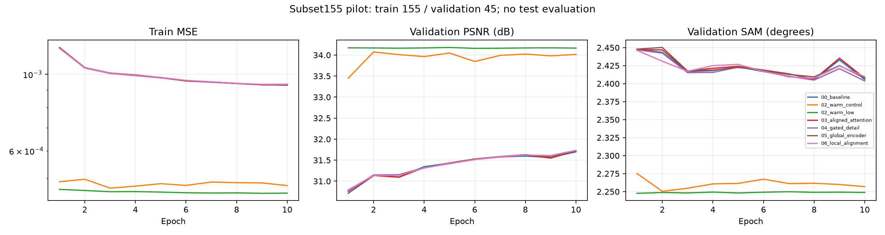

# subset155 · 6단계 축소 예비실험

[현재 연구](../../../README.md)

| 비교 기준 | 이번에 바꾼 점 | 관측된 차이 | 판단 |
|---|---|---|---|
| RGB07 계열 | 학습 155장면의 짧은 후보 탐색 | validation 결과만 사용 | 전체 데이터 학습과 직접 순위 비교하지 않습니다. |

[수치](#3-정량-결과) · [이전 대비](#4-직전-연구와-수치-차이) · [그래프](#5-그래프) · [결과 이미지](#6-결과-이미지-예시)

## 1. 목적과 상태

RGB07 개선 후보를 검증으로 선별하는 합성 ×4 예비실험입니다. RGB 진단과 7개 독립 학습(각 10에폭)이 모두 종료 코드 0으로 완료됐습니다. 2026-10-06 01:06:55–03:37:19 KST, suite `suite_20261005T160615Z`. 코드 기준은 `4dc51d7bb0055342564781a951af18b4c3c12a6d`이며 서버의 subset155 로더·설정 패치는 별도 적용됐습니다. 이 문서 커밋에 실행 코드 전체가 포함됐다는 뜻은 아닙니다.

**학습·검증 실행 완료이며 최종 test 검증은 미실시입니다.** 기존 RGB07 test 결과와 구분합니다.

## 2. 변경 사항과 평가 조건

LIB-HSI train 393장 중 seed42로 선택한 155장, validation 45장 전체(180타일)를 공통 사용했습니다. Windows PowerShell Get-Random으로 정한 목록을 고정했으며 Python 난수 seed만으로 동일 목록을 재생성한다고 가정하지 않습니다. 장면 목록·설정은 [원본 결과 JSON](../pilot_subset155_results.json)에 보존했습니다.

204밴드, HR256/LR64, area ×4 축소, 23tap, latent17, K4, batch4/val_batch2, AMP, seed42, 기존 정합·유효 마스크와 학습/평가 LR 평균 보정을 유지했습니다. RTX A6000 48GB, PyTorch 2.6.0+cu124를 사용했습니다. 파일 대응·ENVI 형식·길이를 검사했지만 cube 내용 전체 해시는 검사하지 않았습니다.

장면 목록 SHA256: `6a98f28f5e3c7e7dc7227919b99530d4ba81bc1eb9f6daa1751b2f86fb224e64`.

00과 03–06은 처음부터 학습하는 독립 구조 비교입니다. 02 두 작업은 같은 RGB07 epoch99 가중치만 불러오고 optimizer·epoch·best를 초기화해 각각 LR1e-4/1e-5로 시작했습니다. 03–06은 누적 개선이 아닙니다.

## 3. 정량 결과

validation 장면별 평균입니다. 각 작업의 best는 검증 MSE 최소 에폭이며, PSNR 최대 에폭으로 따로 고르지 않았습니다. PSNR range=1, 204밴드 장면 MSE 기반입니다.

| 작업 | best epoch | MSE ↓ | PSNR dB ↑ | SAM ° ↓ | gradient RMSE ↓ |
|---|---:|---:|---:|---:|---:|
| 00_baseline10 | 10 | 0.0008318284 | 31.6981 | 2.4058 | 0.025434 |
| 02_warm_control10 | 2 | 0.0004969431 | 34.0741 | 2.2505 | 0.021576 |
| 02_warm_low10 | 5 | 0.0004858836 | 34.1811 | 2.2482 | 0.021444 |
| 03_aligned_attention10 | 10 | 0.0008283217 | 31.7231 | 2.4074 | 0.025393 |
| 04_gated_detail10 | 10 | 0.0008279778 | 31.7271 | 2.4037 | 0.025387 |
| 05_global_encoder10 | 10 | 0.0008293195 | 31.7239 | 2.4077 | 0.025410 |
| 06_local_alignment10 | 10 | 0.0008275112 | 31.7334 | 2.4098 | 0.025372 |

RGB 진단은 동일 가중치와 공통 보수적 마스크(margin4)를 사용합니다. 따라서 위 학습 평가 표와 직접 비교하지 않습니다.

| RGB 조건 | PSNR dB ↑ | SAM ° ↓ |
|---|---:|---:|
| original | 34.2196 | 2.2288 |
| blur_x4 | 31.8059 | 2.3241 |
| shift_left1 | 33.8739 | 2.2449 |
| shift_right1 | 33.8935 | 2.2456 |
| mean_rgb | 31.8134 | 2.3283 |
| zero_rgb | 31.3164 | 2.3948 |

zero/mean은 분포 밖 입력 민감도 검사이며 재학습한 HSI-only 대조군이 아닙니다.

## 4. 직전 연구와 수치 차이

baseline 대비 03/04/05/06의 PSNR 차이는 각각 +0.0249/+0.0290/+0.0258/+0.0352dB입니다. 06은 PSNR이 가장 높지만 SAM은 +0.0040° 악화됐습니다. 04는 SAM −0.0021° 개선입니다. MSE 차이는 각각 −0.0000035066/−0.0000038506/−0.0000025089/−0.0000043171입니다.

warm low는 warm control 대비 PSNR +0.1070dB, SAM −0.0023°, MSE −0.0000110594입니다. 사전 학습 여부가 다른 baseline과 warm을 구조 개선 효과로 비교하지 않습니다.

직전 RGB07의 test75 결과(PSNR34.2831dB, SAM2.1570°)와 이번 validation45 결과는 분할·학습 규모가 달라 직접 비교할 수 없습니다. 원본 RGB07을 동일 평가로 재실행하지 않았으므로 warm이 원본보다 개선됐다고 확정하지 않습니다.

## 5. 그래프

7개 작업의 실제 10에폭 기록입니다. test 비교 그래프는 후보 선별 단계이므로 만들지 않았습니다.

## 6. 결과 이미지 예시

test 데이터는 서버에 올리지 않았고 평가·예시 선택에도 사용하지 않았습니다. 최종 연구 완료 조건인 test 5장면 예시는 이번 예비실험에 없습니다. 후보 확정 후 독립 test 평가와 사전 고정 예시를 별도로 준비해야 합니다.

## 7. 가중치와 검증 근거

[원본 지표·장면별 결과·설정·best/latest 해시](../pilot_subset155_results.json)에 보존했습니다. 실제 가중치는 서버 `/home/gpu_04/ssa-mrn-pilot/SSA-MRN/experiments/checkpoints/pilot-subset155/suite_20261005T160615Z/<작업명>/`의 best.pt/latest.pt이며 Git에 포함하지 않았습니다. 각 best 체크포인트 epoch와 데이터 해시를 확인했습니다.

초기 RGB07 SHA256: `5e126b17f0d95f445e8226fce401d0891593b245b737e73dc2810a3e4510d704`. 모든 작업 10에폭·exit0, 전체 종료 표식 COMPLETE를 확인했습니다. 합성 GPU 검사를 반복하지 않았습니다.

## 8. 한계와 다음 판단

단일 seed·155장·10에폭의 예비실험이므로 구조 변경의 작은 차이를 확정적 개선으로 주장하지 않습니다. 00·03–06은 모두 마지막 에폭이 best여서 수렴 여부도 미확인입니다. warm LR1e-5를 우선 검토하고 구조 후보는 gated detail의 분광 지표와 local alignment의 공간 지표를 함께 고려합니다. 같은 조건의 원본 RGB07 평가 및 필요 시 반복 검증 후 후보를 정합니다. 합성 축소 결과를 실제 센서 HR-HSI 성능으로 해석하지 않습니다.
