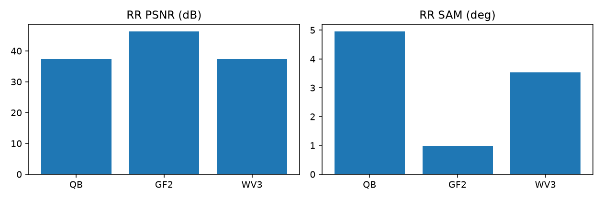
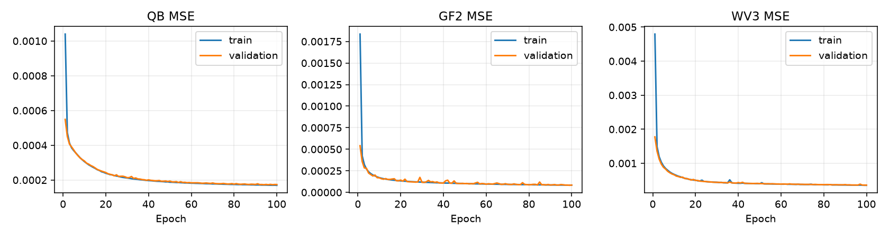
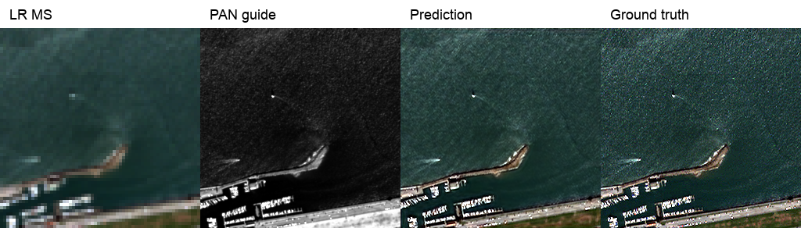
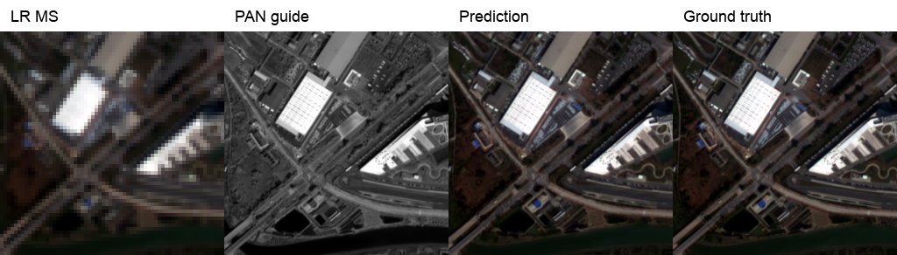
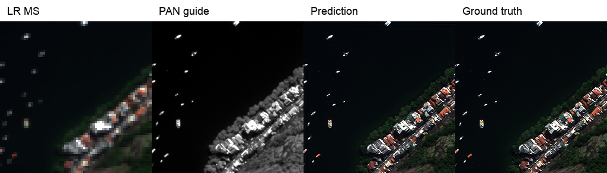

# PAN–MS 재현 K4

[재현 연구 목록](../../reproduction.md) · [현재 연구](../../../README.md)

| 비교 기준 | 이번에 바꾼 점 | 관측된 차이 | 판단 |
|---|---|---|---|
| 첫 PAN–MS 재현 | 공식 K4 코드의 실행·학습·평가 복원 | 센서별 RR/FR 수치는 3절 | 논문 수치와 구현·평가의 남은 차이를 기록했습니다. |

[수치](#3-정량-결과) · [이전 대비](#4-직전-연구와-수치-차이) · [그래프](#5-그래프) · [결과 이미지](#6-결과-이미지-예시)

## 1. 목적과 상태

완료. 공식 SSA-MRN 구현을 기준으로 PAN–MS 학습과 평가 파이프라인을 복원했습니다.

## 2. 변경 사항과 평가 조건

QB/GF2/WV3/WV2 각각 RR 20장, FR 20장 (총 160장). WV2는 WV3 가중치로 평가했습니다. RR에는 정답 기반 PSNR/SAM/ERGAS/SCC/Q, FR에는 QNR/Dλ/Ds를 사용합니다. 제공 LMS 입력은 23탭 보간 계열이며 네트워크 내부 확대·축소는 Bilinear (`align_corners=True`)입니다.

## 3. 정량 결과

### SSA-MRN 논문 수치와 K=4 공개 코드 재현 비교

2026-09-28 기준. PanCollection의 센서별 ReducedData(RR)·FullData(FR) H5를 각 20장씩, 총 160장 평가했다. QB·GF2·WV3는 각각 100-epoch `latest.pt`를, WV2는 논문처럼 WV3 가중치를 사용했다. 표의 `현재`는 **이미지별 지표를 계산한 뒤 20장 산술평균**한 값이다. 논문 열은 Tables I–IV의 *Ours* 행이다.

| 센서 | SAM↓ 논문/현재 | ERGAS↓ 논문/현재 | PSNR↑ 논문/현재 | SCC↑ 논문/현재 | Q4·Q8↑ 논문/현재 |
|---|---:|---:|---:|---:|---:|
| QB | 4.8478 / 4.9557 | 4.0726 / 4.1555 | 37.6645 / 37.3608 | .9702 / .9765 | .9243 / .9214 |
| GF2 | .9434 / .9668 | .8755 / .9125 | 46.9734 / 46.3520 | .9898 / .9816 | .9688 / .9661 |
| WV3 | 3.4873 / 3.5277 | 2.5866 / 2.5822 | 37.5691 / 37.3894 | .9735 / .9779 | .8930 / .8753 |
| WV2 | 5.8845 / 5.9265 | 4.7254 / 4.8002 | 29.4148 / 29.0611 | .9217 / .8959 | .8215 / .8190 |

| 센서 | Dλ↓ 논문/현재 | Ds↓ 논문/현재 | QNR↑ 논문/현재 |
|---|---:|---:|---:|
| QB | .0341 / .0479 | .0360 / .0396 | .9311 / .9147 |
| GF2 | .0395 / .0350 | .0487 / .0565 | .9137 / .9106 |
| WV3 | .0329 / .0221 | .0617 / .0382 | .9077 / .9408 |
| WV2 | .0657 / .0511 | .0549 / .0382 | .8831 / .9126 |

**평가 설정:** 논문이 PSNR의 기준 최댓값과 집계 방식을 공개하지 않아, 확인한 계산 방식 중 논문 수치에 가장 가까운 **전 센서 peak 2047·밴드별 PSNR 산술평균**을 적용했다. 이는 논문 저자의 실제 계산법이 확인됐다는 뜻이 아니며, GF2의 학습 입력 정규화 기준 1023도 변경하지 않았다. SCC 경계 처리와 Q4/Q8의 MATLAB 구현 일치성도 미검증이다. FR의 PAN 축소는 MATLAB `imresize`가 아니라 scikit-image를 사용하므로 Dλ·Ds·QNR은 잠정치다. 평가식 선택만으로 모델 출력이나 화질이 개선된 것은 아니다.

또한 공개 `network.py`의 SSA 내부 차원 K=4·어텐션 연산은 논문 설명(K=6 등)과 다르다. 이 문서의 가중치와 수치는 **K=4 공개 코드를 복구하여 학습한 모델**의 결과다. 향후 MATLAB 평가 툴박스와 동일 입력을 대조하고, 논문의 누락 설정을 확인한 뒤 수치를 다시 비교해야 한다.

서로 다른 센서의 PSNR을 평균내어 RGB–HSI와 비교하지 않습니다.

## 4. 직전 연구와 수치 차이

첫 재현 실험이므로 직전 연구와의 차이 없음.

## 5. 그래프

기존 epoch 로그의 학습/검증 MSE 100개를 compact 숫자 기록으로 보존했습니다.

## 6. 결과 이미지 예시

왼쪽부터 LR MS, PAN guide, 예측, 정답입니다. 과거 보관된 3개 센서 예시이며 미래 실험의 5장면 필수 규칙과 구분합니다.

## 7. 가중치와 검증 근거

센서별 원본 평가 기록은 `experiments/results/pan_k4/full_metrics/`에 보존합니다. 재평가는 `scripts/evaluate_paper.py`를 사용합니다. 과거 재학습 전용 명령은 정리했으며 가중치는 보존합니다.

`experiments/checkpoints/{qb,gf2,wv3}_full/latest.pt`를 보존합니다. 이미지와 숫자 JSON은 `experiments/results/`에 보존합니다.

## 8. 한계와 다음 판단

공식 코드의 attention 곱 연산 등 논문 수식과 구현 차이가 있어 논문과 완전히 동일한 실행으로 주장하지 않습니다. RGB–HSI의 204밴드 복원과 독립된 재현 결과입니다.
