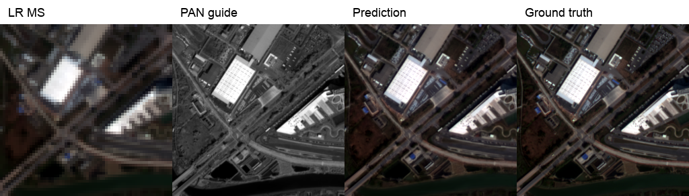
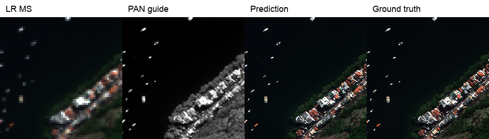

# PAN–MS 재현 K6

[재현 연구 목록](../../reproduction.md) · [현재 연구](../../../README.md)

| 비교 기준 | 이번에 바꾼 점 | 관측된 차이 | 판단 |
|---|---|---|---|
| PAN K4 | SSAI 차원 K4→K6 | QB/WV3 RR 개선, GF2 RR 악화 | 장치도 달라 K만의 효과로 해석하지 않습니다. |

[수치](#3-정량-결과) · [이전 대비](#4-직전-연구와-수치-차이) · [그래프](#5-그래프) · [결과 이미지](#6-결과-이미지-예시)

## 1. 목적과 상태

완료. 공식 SSA-MRN 구현을 기준으로 PAN–MS 학습과 평가 파이프라인을 복원했습니다.

## 2. 변경 사항과 평가 조건

QB/GF2/WV3 각각 RR 20장, FR 20장. RR에는 정답 기반 PSNR/SAM/ERGAS/SCC/Q, FR에는 QNR/Dλ/Ds를 사용합니다. 제공 LMS 입력은 23탭 보간 계열이며 네트워크 내부 확대·축소는 Bilinear (`align_corners=True`)입니다.

### SSA-MRN K=6 로컬 실험

### 목적과 변경 변수

기존 재현 가중치는 공개 `network.py`의 SSAI 차원 K=4로 학습했다. [논문](https://doi.org/10.1109/JSTARS.2025.3543827)은 K=6을 명시한다. 이번 실험은 SSAI 차원을 6으로 바꾸고, 센서별 데이터 분할, MSE, Adam, 배치 32, 초기 학습률 1e-4, 100 epochs, 시드 42를 유지했다. 시드 42는 재현 실험 값이며 논문에 공개된 값은 아니다. K=6은 합성곱의 채널 수를 바꾸므로 기존 K=4 가중치에서 이어 학습할 수 없고 처음부터 학습했다.

K=4는 RTX A6000에서, K=6은 아래 Radeon DirectML 환경에서 학습했다. 모델 차원 외에 실행 장치와 백엔드도 달라, 관측된 성능 차이를 **K 값만의 인과 효과**로 해석할 수 없다. 같은 환경에서 두 설정을 다시 학습·평가해야 통제된 비교가 된다. 여기서는 확보된 결과를 비교 기준으로 기록한다.

이 저장소는 공식 모델 코드를 하위 모듈로 고정해 둔다. K=6 변형은 재현용 래퍼에서 사용되는 SSAI 계층과 융합 계층에만 적용한다. K=4 경로와 기존 체크포인트는 계속 읽을 수 있다. 논문 수식의 어텐션 행렬곱과 공개 코드의 원소별 곱 차이는 이번 실험에서 변경하지 않는다. 따라서 K=6 결과도 논문 구현과 완전히 같다고 주장할 수 없다.

## 3. 정량 결과

### 센서별 상세 비교

논문에서는 SSAI의 feature dimension인 K를 6으로 설정한다. 공개 코드의 기존 재현 설정은 K=4였으므로, 다른 주요 학습 조건은 유지한 채 K=6으로 변경하여 QB, GF2, WV3를 각각 100 epochs 재학습하였다.

평가는 각 센서의 Reduced Resolution(RR) 및 Full Resolution(FR) 데이터에서 각각 20 samples를 사용하였다.

### QuickBird (QB)

| Metric | 논문 | K=4 | K=6 |
|---|---:|---:|---:|
| SAM ↓ | 4.8478 | 4.9557 | 4.9350 |
| ERGAS ↓ | 4.0726 | 4.1555 | 4.0875 |
| PSNR ↑ | 37.6645 | 37.3608 | 37.5040 |
| SCC ↑ | 0.9702 | 0.9765 | 0.9774 |
| Q4 ↑ | 0.9243 | 0.9214 | 0.9256 |
| Dλ ↓ | 0.0341 | 0.0479 | 0.0484 |
| Ds ↓ | 0.0360 | 0.0396 | 0.0470 |
| QNR ↑ | 0.9311 | 0.9147 | 0.9072 |

QB에서는 K=6 적용 후 RR 지표가 전반적으로 개선되었으나, FR 지표는 K=4보다 일부 악화되었다.

### Gaofen2 (GF2)

| Metric | 논문 | K=4 | K=6 |
|---|---:|---:|---:|
| SAM ↓ | 0.9434 | 0.9668 | 1.0035 |
| ERGAS ↓ | 0.8755 | 0.9125 | 0.9693 |
| PSNR ↑ | 46.9734 | 46.3520 | 45.8631 |
| SCC ↑ | 0.9898 | 0.9816 | 0.9793 |
| Q4 ↑ | 0.9688 | 0.9661 | 0.9632 |
| Dλ ↓ | 0.0395 | 0.0350 | 0.0355 |
| Ds ↓ | 0.0487 | 0.0565 | 0.0502 |
| QNR ↑ | 0.9137 | 0.9106 | 0.9161 |

GF2에서는 K=6 적용 후 RR 지표는 K=4보다 낮아졌지만, FR의 Ds와 QNR은 개선되는 혼합된 결과가 나타났다.

### WorldView3 (WV3)

| Metric | 논문 | K=4 | K=6 |
|---|---:|---:|---:|
| SAM ↓ | 3.4873 | 3.5277 | 3.4504 |
| ERGAS ↓ | 2.5866 | 2.5822 | 2.5329 |
| PSNR ↑ | 37.5691 | 37.3894 | 37.6326 |
| SCC ↑ | 0.9735 | 0.9779 | 0.9789 |
| Q8 ↑ | 0.8930 | 0.8753 | 0.8829 |
| Dλ ↓ | 0.0329 | 0.0221 | 0.0155 |
| Ds ↓ | 0.0617 | 0.0382 | 0.0330 |
| QNR ↑ | 0.9077 | 0.9408 | 0.9522 |

WV3에서는 K=6 적용 후 K=4 대비 RR 및 FR 지표가 전반적으로 개선되었다.

서로 다른 센서의 PSNR을 평균내어 RGB–HSI와 비교하지 않습니다.

## 4. 직전 연구와 수치 차이

| 센서 | ΔPSNR dB (K6−K4) | ΔSAM ° (K6−K4) |
|---|---:|---:|
| QB | +0.1432 | -0.0207 |
| GF2 | -0.4889 | +0.0367 |
| WV3 | +0.2432 | -0.0773 |

MSE는 기존 보고서에 동일 기준의 비교값이 없어 차이를 계산하지 않습니다.

K4는 CUDA/A6000, K6는 DirectML/Radeon이므로 K만 바꾼 통제 실험이 아닙니다.

## 5. 그래프

과거 학습 곡선을 일관되게 확보하지 못해 실제 최종 평가 수치의 그래프로 대신합니다.

## 6. 결과 이미지 예시

왼쪽부터 LR MS, PAN guide, 예측, 정답입니다. 과거 보관된 3개 센서 예시이며 미래 실험의 5장면 필수 규칙과 구분합니다.

## 7. 가중치와 검증 근거

센서별 원본 평가 기록은 `experiments/results/pan_k6/full_metrics/`에 보존합니다. 재평가는 `scripts/evaluate_paper.py`를 사용합니다. 과거 재학습 전용 명령은 정리했으며 가중치는 보존합니다.

`experiments/checkpoints/k6/{qb,gf2,wv3}_full/latest.pt`를 보존합니다. 이미지와 숫자 JSON은 `experiments/results/`에 보존합니다.

## 8. 한계와 다음 판단

공식 코드의 attention 곱 연산 등 논문 수식과 구현 차이가 있어 논문과 완전히 동일한 실행으로 주장하지 않습니다. RGB–HSI의 204밴드 복원과 독립된 재현 결과입니다.
