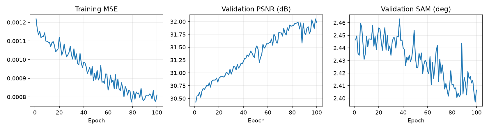
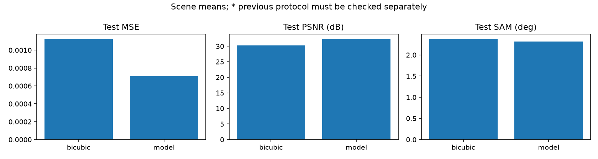
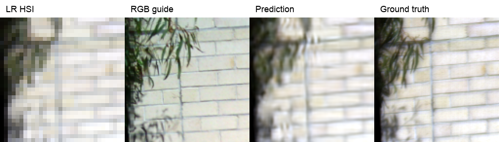

# RGB 01 · 8특징 Bicubic 128

[이전 실험 목록](../../previous_experiments.md) · [현재 연구](../../../README.md)

| 비교 기준 | 이번에 바꾼 점 | 관측된 차이 | 판단 |
|---|---|---|---|
| 첫 RGB–HSI 실험 | 204→8특징, Bicubic, 128 타일 | PSNR 32.3048 / SAM 2.3161 | RGB–HSI 확장 기준을 확보했습니다. |

[수치](#3-정량-결과) · [이전 대비](#4-직전-연구와-수치-차이) · [그래프](#5-그래프) · [결과 이미지](#6-결과-이미지-예시)

## 1. 목적과 상태

완료. RGB 유도 HSI의 공간 해상도 ×4 복원. 실제 센서 HR-HSI 정답이 있는 실험이 아니라, 관측 HSI를 합성 축소한 정량 평가입니다.

## 2. 변경 사항과 평가 조건

K=6 · 204→8 dense 압축 · RGB 공통 core · 128→32→128 · 정합 보정 없음 · random crop 학습 / 128 타일 평가

- LIB-HSI 204밴드, train/validation/test = 393/45/75 장면. 패치는 독립 장면으로 세지 않습니다.
- 전체 test 장면별 지표의 평균. MSE는 204밴드, PSNR data range=1, SAM은 유효 스펙트럼 대상.
- 정합 적용 실험은 유효 마스크를 사용합니다. 정합 보정은 HR-HSI 참조를 활용하므로 실제 배포 전처리 성능과 구분합니다.

## 3. 정량 결과

| 방법 | MSE ↓ | PSNR dB ↑ | SAM ° ↓ |
|---|---:|---:|---:|
| Bicubic | 0.0011245480 | 30.2187 | 2.3771 |
| SSA-MRN 확장 | 0.0007064470 | 32.3048 | 2.3161 |

## 4. 직전 연구와 수치 차이

첫 RGB–HSI 실험으로 이전 RGB 연구 수치가 없습니다.

**비교 해석:** 첫 RGB–HSI 연구. PAN–MS와 데이터·밴드·평가 과제가 달라 수치 차이를 비교하지 않습니다.

## 5. 그래프

원본 기록에서 추출한 [epoch 수치](../../../experiments/results/rgb01_latent8/curves.json). 기록이 없는 epoch를 보간하거나 만들어 넣지 않았습니다. test 결과를 epoch 선택에 사용하지 않습니다.

직전 수치 비교 그래프의 `previous*`는 평가 조건 확인이 필요한 관측값입니다.

## 6. 결과 이미지 예시

왼쪽부터 LR HSI, RGB guide, 예측 HSI, HSI 정답입니다. HSI는 69/52/18 밴드의 GT 1–99% 범위를 공통 적용한 시각화이며, 지표 계산에는 대비 조정을 적용하지 않습니다. LR 표시는 최근접 확대로 픽셀을 보여줍니다.

### 예시 1 · 2020-11-20_017 · tile 0, sample index 0

과거 보관 예시는 1개입니다. 없는 예측을 새 결과로 생성하지 않았으며, 앞으로 완료되는 실험에는 서로 다른 test 장면 5개가 필수입니다.

## 7. 가중치와 검증 근거

- [전체 test 수치](../../../experiments/results/rgb01_latent8/test_metrics.json)
- best epoch 99, latest epoch 100. 초기 재개로 반복된 epoch는 마지막 기록을 사용했습니다.
- 서버 가중치: `C:\CtrS\SSA-MRN\experiments\checkpoints\lib_rgb_hsi_fast`.
- 학습된 `.pt`는 보존합니다. 구조/평가 조건은 체크포인트 내 `config`를 읽어 평가할 수 있으므로 과거 별도 학습 JSON은 폐기했습니다.

## 8. 한계와 다음 판단

합성 축소 결과는 실제 센서 쌍의 초해상도 정답 성능을 증명하지 않습니다. RGB–HSI 정합 잔차, 축소 커널 및 타일 경계의 영향을 별도 검증해야 합니다.
