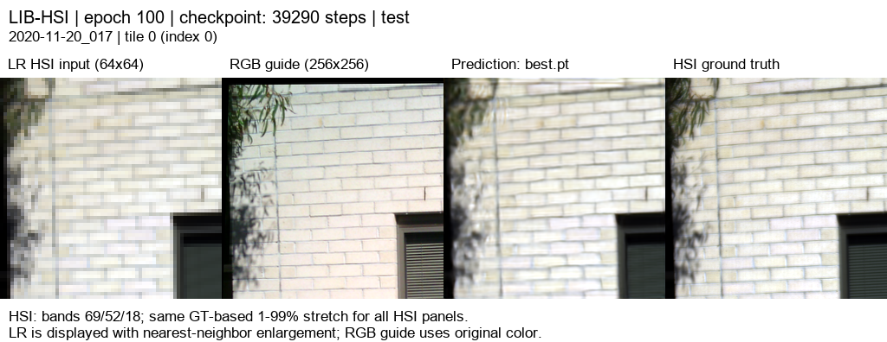
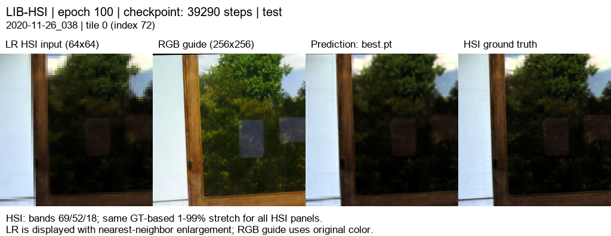

# RGB 05 · RGB별 12특징 Bilinear 타일

[현재 연구](../../../README.md) · [이전 실험 목록](../../previous_experiments.md)

| 비교 기준 | 이번에 바꾼 점 | 관측된 차이 | 판단 |
|---|---|---|---|
| RGB04 | core 내부 축소·확대를 Bilinear로 변경 | PSNR −0.2633 dB / SAM +0.0133° | 내부 Bilinear를 채택하지 않고 23탭을 복구했습니다. |

[수치](#3-정량-결과) · [이전 대비](#4-직전-연구와-수치-차이) · [그래프](#5-그래프) · [결과 이미지](#6-결과-이미지-예시)

## 1. 목적과 상태

완료: 100/100 epoch, 종료 코드 0, 2026-10-04 03:09(KST). 학습 코드 `d947f84`, run `20261003-220209-d4faa37d0365`. 직전 triple12의 내부 보간만 재현 네트워크와 맞춰 공간 선명도와 분광 오차를 비교합니다. validation으로 선택한 best epoch 100을 전체 test 75장면(300타일)에 평가했습니다.

## 2. 변경 사항과 평가 조건

| 항목 | 직전 triple12 | 현재 실험 |
|---|---|---|
| RGB core | R/G/B 각각 12특징 | 동일 |
| HSI 압축 | 204→12, 17밴드씩 | 동일 |
| SSAI K / parameters | 4 / 1,950,186 | 동일 |
| 내부 guide·특징 축소 | 평균 풀링 | Bilinear align_corners=True |
| 내부 guide·특징 확대 | 23탭 | Bilinear align_corners=True |
| HSI 합성 축소 / LMS | area ×4 / 23탭 | 동일 |
| train / validation / test | 393 / 45 / 75 장면 | 동일 |
| HR / LR / 평가 | 256 / 64 / tiles | 동일 |
| 정합·유효 마스크 | projective fixed manifest | 동일 |
| RGB 출력 결합 | bandwise learned fusion | 동일 |

RTX 3060 Ti 8GB, torch 2.7.1+cu128, AMP, batch 4. 원격 controller 실행이므로 Mac/SSH 접속 종료와 학습 실행은 분리되어 있습니다. 내부 보간은 PAN–MS 재현 코드와 맞췄지만, area 입력 축소·압축·잔차 구조까지 원 재현 모델과 같아진 것은 아닙니다.

## 3. 정량 결과

| test 75장면 평균 | MSE ↓ | PSNR dB ↑ | SAM ° ↓ |
|---|---:|---:|---:|
| 23탭 baseline | 0.0013944695 | 29.2259 | 2.4790 |
| Bilinear triple12 | 0.0005064195 | 33.7897 | 2.2190 |
| baseline 대비 | 63.68% 감소 | +4.5639 | −0.2601 |

204밴드, 유효 정합 마스크 적용, 장면별 지표의 평균입니다. PSNR은 range=1의 전체 밴드 장면 MSE로 계산하며, 예측은 지표 계산 시 clip하지 않습니다. SAM은 GT가 0인 픽셀을 제외합니다. 300타일은 독립 장면 75개의 분할입니다.

## 4. 직전 연구와 수치 차이

| 지표 | 직전 내부 23탭 | 현재 내부 Bilinear | 현재−직전 |
|---|---:|---:|---:|
| MSE ↓ | 0.0004733597 | 0.0005064195 | +0.0000330598 (+6.98%) |
| PSNR dB ↑ | 34.0530 | 33.7897 | −0.2633 |
| SAM ° ↓ | 2.2057 | 2.2190 | +0.0132 |

**이번 실험에서는 개선되지 않았습니다.** 두 체크포인트 설정의 차이는 model_type과 결과 저장 경로뿐입니다. test 75장면의 ID·순서, 타일 평가, 마스크, 축소 및 장면별 baseline 수치가 모두 같음을 확인했습니다. 단일 seed 결과이므로 Bilinear가 항상 불리하다는 결론이나 통계적 유의성을 주장하지 않습니다.

## 5. 그래프

[100 epoch 수치](../../../experiments/results/rgb05_triple12_bilinear/curves.json). test를 best 선택에 사용하지 않았습니다.

## 6. 결과 이미지 예시

사전 고정한 이전 연구와 동일한 5장면 `[3, 0, 43, 18, 63]`의 tile 0입니다. 왼쪽부터 **LR HSI · RGB · 예측 · 정답**입니다. 지표를 보고 장면을 재선택하지 않았습니다.

[보존된 204밴드 HTML](../../assets/rgb05_triple12_bilinear/band_viewer/index.html) (내려받아 실행).

슬라이더는 같은 best 가중치의 CPU float32 추론이며 PNG의 CUDA AMP 추론과 미세한 차이가 있을 수 있습니다. 밴드별 GT 유효 영역의 1–99% 범위를 HSI 세 패널에 공통 적용한 8비트 표시입니다. 표시 대비는 정량 지표에 사용하지 않으며, 파장은 확인되지 않아 밴드 번호를 사용합니다.

### 예시 1

### 예시 2

### 예시 3

### 예시 4

### 예시 5

[장면·타일 선택 기록](../../../experiments/results/rgb05_triple12_bilinear/selection.json)

## 7. 가중치와 검증 근거

- [전체·장면별 test 지표](../../../experiments/results/rgb05_triple12_bilinear/test/metrics.json)
- [가중치 epoch·SHA-256](../../../experiments/results/rgb05_triple12_bilinear/checkpoint_metadata.json)
- [평가 조건·완료 기록](../../../experiments/results/rgb05_triple12_bilinear/report_manifest.json)
- best/latest epoch: 100/100. 학습 코드 `d947f84`, 결과 exporter 코드 `6a488a8`.
- 서버 가중치: `C:\CtrS-triple12-bilinear\SSA-MRN\experiments\checkpoints\remote-runs\20261003-220209-d4faa37d0365`.
- 정합 manifest SHA-256: `7a66ad28bc78fe8691fddbc2d94f0a871d7c10507407f7d1f36abe1b20f004f4`.

## 8. 한계와 다음 판단

합성 area ×4 평가입니다. 관측 HSI를 정답으로 사용하므로 실제 센서 해상도를 넘어선 HR-HSI 정확도를 검증한 것은 아닙니다. GT를 활용한 정합과 유효 영역 마스크도 실제 배포 조건과 구분해야 합니다. 독립 test 장면은 75개이며 타일을 독립 표본으로 간주하지 않습니다.

내부 보간을 재현 모델과 맞춘 것만으로 이번 결과는 개선되지 않았습니다. 공간 선명도와 분광 보존의 원인을 분리하려면 HSI-only, RGB 정합 오차 및 특징 압축에 대한 통제 실험이 필요합니다. 이 보고서 작성에서는 새 학습을 실행하지 않았습니다.
