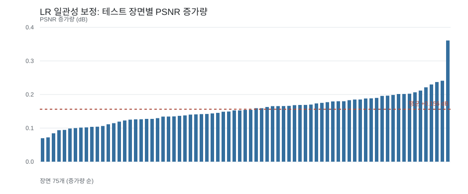
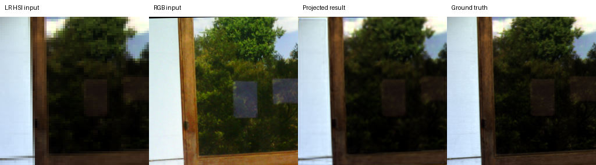

# RGB 06 후처리 · LR 평균 일관성 보정

[현재 연구](../../../README.md) · [원래 RGB06 실험](rgb06_triple17_spectral.md)

| 비교 기준 | 이번에 바꾼 점 | 관측된 차이 | 판단 |
|---|---|---|---|
| RGB06 | 재학습 없이 LR 평균 일관성 보정 | PSNR +0.1562 dB / SAM −0.0381° | 후속 구조의 기본 보정으로 채택했습니다. |

[수치](#3-정량-결과) · [이전 대비](#4-직전-연구와-수치-차이) · [그래프](#5-그래프) · [결과 이미지](#6-결과-이미지-예시)

## 1. 목적과 상태

완료된 RGB06의 **동일한 best 가중치**에 재학습 없는 후처리를 적용했습니다. 2026-10-05에 검증 45장면과 보류된 테스트 75장면을 순서대로 평가했습니다. 이 결과는 LIB-HSI의 관측 HSI를 합성 `area` 축소한 ×4 복원에 해당합니다.

## 2. 변경 사항과 평가 조건

모델 출력 고해상도 HSI 예측값(Ĥ)를 4×4 평균 축소한 값과 LR HSI 입력 `Y`의 차이를 해당 4×4 영역의 모든 픽셀에 더합니다.

```math
\widehat{H}_{\mathrm{DC}}
=
\widehat{H}
+
U_{\mathrm{repeat}}\left(
Y-D_{\mathrm{area}}(\widehat{H})
\right)
```

정합 마스크의 16픽셀이 모두 유효한 블록에만 보정합니다. 혼합 블록은 건드리지 않습니다. RGB06과 같은 204밴드, HR256/LR64, K=4, 17특징, 23탭 출력, 4타일/장면, 정합 manifest와 유효 마스크를 사용했습니다. 모델과 23탭 기준선에 **동일한 보정**을 적용했습니다. GT는 지표와 표시용 대비에만 사용하며 보정 입력에는 사용하지 않습니다.

## 3. 정량 결과

| 분할·방법 | MSE ↓ | PSNR dB ↑ | SAM ° ↓ |
|---|---:|---:|---:|
| 검증 · RGB06 원래 출력 | 0.0005113355 | 33.9137 | 2.2925 |
| 검증 · **LR 보정** | **0.0004958722** | **34.0680** | **2.2541** |
| 테스트 · 23탭 기준선 | 0.0013944695 | 29.2259 | 2.4790 |
| 테스트 · 23탭 기준선 + LR 보정 | 0.0011539606 | 30.0649 | 2.4450 |
| 테스트 · RGB06 원래 출력 | 0.0004716392 | 34.0611 | 2.2006 |
| 테스트 · **LR 보정** | **0.0004559785** | **34.2173** | **2.1625** |

장면별 MSE에서 PSNR을 구하고 장면 평균을 냈습니다. 정답 반사율은 [0,1], 출력은 지표 전에 자르지 않았습니다. SAM은 정답 스펙트럼의 norm이 1e−6보다 큰 유효 픽셀을 사용했습니다. 검증 45/45장면, 테스트 75/75장면에서 MSE와 SAM이 개선됐습니다. 테스트 장면별 PSNR 증가는 **0.070~0.361 dB**입니다. 300타일은 독립 장면 75개의 분할입니다.

## 4. 직전 연구와 수치 차이

직전 학습 연구 RGB06의 동일 체크포인트·동일 테스트에 비해 PSNR은 **+0.1562 dB**, SAM은 **−0.0381°**, MSE는 **−0.0000156607**입니다. 이 차이는 네트워크 재학습이나 새 구조의 효과가 아니라 출력의 LR 평균을 맞춘 후처리 효과입니다. 보정 전 RGB06 수치는 저장된 기존 평가와 계산 오차 수준에서 일치합니다.

## 5. 그래프



[원래 RGB06의 학습·검증 곡선](../../assets/rgb06_triple17_spectral/learning.png)은 같은 가중치의 기록입니다. 후처리에는 별도의 학습 곡선이 없습니다.

## 6. 결과 이미지 예시

RGB06에서 수치를 보기 전에 고정한 서로 다른 테스트 장면 `[3, 0, 43, 18, 63]`, 각 장면의 tile0입니다. 왼쪽부터 **LR HSI · RGB 입력 · LR 보정 결과 · 정답**입니다. HSI의 표시용 69/52/18번 밴드에는 정답의 밴드별 1~99% 대비를 동일하게 사용했습니다. 정량 평가는 모든 204밴드 원래 값을 사용했습니다.





이 실험의 LR 보정 전 RGB06 영상은 [보존 HTML](../../assets/rgb06_triple17_spectral/band_viewer/index.html)에서 확인합니다. 해당 HTML은 보정 후 결과가 아닙니다. 공개 Pages는 최신 대표 연구인 RGB11을 표시합니다.

## 7. 가중치와 검증 근거

- [검증 전체·장면별 JSON](../../../experiments/results/rgb06_lr_consistency/validation.json)
- [테스트 전체·장면별 JSON](../../../experiments/results/rgb06_lr_consistency/test.json)
- [고정 5장면 선택 기록](../../../experiments/results/rgb06_triple17_spectral/selection.json)
- [원래 best 가중치 기록](../../../experiments/results/rgb06_triple17_spectral/checkpoint_metadata.json): epoch 99, SHA-256 `f9dcc29f1dd93980c2d405ed303e8d243d0a65e9246f5e172e021962ff7308d8`.
- [체크포인트와 해시가 일치하는 정합 manifest](../../../experiments/results/rgb06_lr_consistency/alignment_manifest.json): SHA-256 `7a66ad28bc78fe8691fddbc2d94f0a871d7c10507407f7d1f36abe1b20f004f4`.

현재 `main`의 기존 정합 manifest는 파싱된 JSON 내용은 같지만 바이트 배열과 SHA-256이 다릅니다. 체크포인트는 원본 바이트 해시를 검사하므로, 재평가에는 위 보관본을 `--alignment-manifest`로 지정합니다. 기존 manifest를 덮어쓰지 않아 과거 체크포인트의 검증 조건을 보존합니다.

새 평가는 `export_results.py --area-consistency --alignment-manifest <보관본 경로>`를 사용합니다. 플래그는 평가, 4패널 예시, 오프라인 밴드 뷰어에 함께 전달됩니다. 원래 모델 결과는 `--area-consistency` 없이 재현할 수 있습니다. 기존 가중치·원본 데이터·보정 전 결과는 보존했습니다.

## 8. 한계와 다음 판단

MSE 비증가 성질은 **노이즈 없는 4×4 평균 축소**와 완전 유효 블록에서 성립합니다. 이 방법은 새 고주파 정보를 만들어 주지 않으며 시각적 선명도 또는 SAM의 이론적 개선을 보장하지 않습니다. 실제 센서의 축소·노이즈·정합 과정에는 동일한 보장을 적용할 수 없습니다. 해당 조건은 별도 실험으로 확인해야 합니다.
