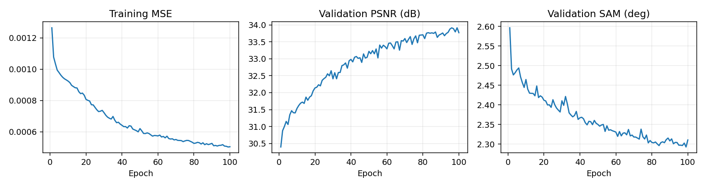
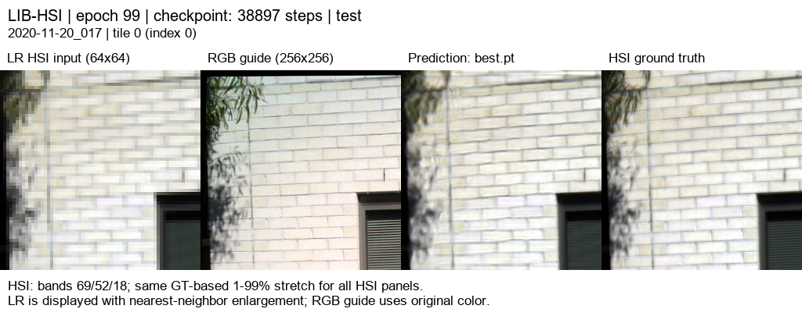
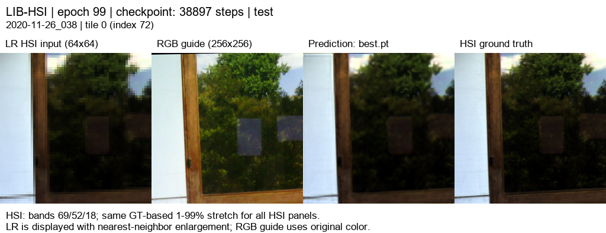

# RGB 06 · RGB별 17특징 23탭 + 분광 손실

[현재 연구](../../../README.md) · [이전 실험](../../previous_experiments.md)

| 비교 기준 | 이번에 바꾼 점 | 관측된 차이 | 판단 |
|---|---|---|---|
| RGB04의 23탭 기준 | 17특징으로 확대하고 분광 방향 손실 추가 | PSNR +0.0081 dB / SAM −0.0051° | 작은 개선이며 특징 수와 손실 효과가 함께 포함됩니다. |

[수치](#3-정량-결과) · [이전 대비](#4-직전-연구와-수치-차이) · [그래프](#5-그래프) · [결과 이미지](#6-결과-이미지-예시)

## 1. 목적과 상태

완료: 100/100 epoch, 종료 코드 0, 2026-10-05 05:10(KST). best epoch99를 전체 test75장면·300타일에 평가했습니다. 기존 분광 각도 기반 재질 분류 아이디어를 복원 손실로 옮기는 제안이며 원 논문 복원 손실의 직접 재현은 아닙니다.

## 2. 변경 사항과 평가 조건

204→17 grouped 1×1 학습 압축(인접 12밴드/특징), RGB별 독립 경로, K=4, 204밴드 출력. 내부 평균 축소·23탭 확대를 복구합니다. 입력 area ×4 / 23탭 baseline, HR256/LR64, quadrants 학습·tiles 평가, 393/45/75 장면, seed42, 정합 manifest·마스크는 유지합니다.

손실은 `masked MSE + spectral_weight × mean(1−cos(pred,GT))`. float32로 계산하고 GT와 예측 모두 L2 norm >1e−6인 정합 유효 픽셀만 분광 항에 포함합니다. 빈 마스크는 0으로 처리합니다. MSE에는 어두운 유효 픽셀도 포함합니다. 로그에는 train_mse/train_spectral/train_loss를 분리합니다. best는 기존과 동일하게 validation MSE로 선택합니다.

λ=0.01은 최적값이 아닌 초기 후보입니다. 0/0.001/0.01/0.1을 별도 run으로 검증하고 validation PSNR·SAM으로 선택해야 합니다. test로 λ를 고르지 않습니다. 이번 run은 λ=0.01만 학습했습니다. λ sweep은 수행하지 않았으므로 최적값이라고 주장하지 않습니다.

## 3. 정량 결과

| test 75장면 평균 | MSE ↓ | PSNR dB ↑ | SAM ° ↓ |
|---|---:|---:|---:|
| 23탭 baseline | 0.0013944695 | 29.2259 | 2.4790 |
| 17특징 + 분광 손실 | 0.0004716392 | 34.0611 | 2.2006 |

204밴드 유효 마스크에서 장면별 지표를 계산한 평균입니다. PSNR range=1, unclipped 예측, SAM은 GT 0벡터 제외. baseline 대비 PSNR +4.8352 dB, SAM -0.2784°. 300타일은 독립 장면75개의 분할입니다.

## 4. 직전 연구와 수치 차이

| 기준 | MSE | PSNR dB | SAM ° | 현재−기준 PSNR / SAM |
|---|---:|---:|---:|---|
| 직전 RGB05 · 12특징 Bilinear | 0.0005064195 | 33.7897 | 2.2190 | +0.2714 / -0.0184 |
| 복구 기준 RGB04 · 12특징 23탭 | 0.0004733597 | 34.0530 | 2.2057 | +0.0081 / -0.0051 |
| 현재 RGB06 · 17특징 23탭+분광 | 0.0004716392 | 34.0611 | 2.2006 | — |

MSE 차이는 직전 대비 -0.0000347803, 복구 기준 대비 -0.0000017205입니다. 75장면 ID·순서, 타일, 정합 마스크, 평가 protocol, 장면별 baseline 수치가 같은지 대조했습니다. RGB04 대비 차이는 작습니다. 단일 seed 결과이며 압축·손실을 동시에 변경했으므로 분광 손실만의 효과나 통계적 유의성을 주장하지 않습니다.

## 5. 그래프

[100 epoch 수치](../../../experiments/results/rgb06_triple17_spectral/curves.json): train_mse, train_spectral, train_loss를 별도로 보존했습니다. test는 best 선택에 사용하지 않았습니다.

## 6. 결과 이미지 예시

이전 실험과 동일한 사전 고정 5장면 `[3,0,43,18,63]`, tile0입니다. 왼쪽부터 **LR HSI · RGB · 예측 · 정답**입니다.

[오프라인 HTML](../../assets/rgb06_triple17_spectral/band_viewer/index.html). 같은 best 가중치의 CPU float32 HTML이며 PNG는 CUDA AMP입니다. GT 유효 영역의 밴드별 1–99% 범위를 HSI 세 패널에 공통 적용한 8비트 표시입니다. 대비는 지표 계산에 사용하지 않으며 파장은 확인되지 않아 밴드 번호로 표시합니다.

### 예시 1

### 예시 2

### 예시 3

### 예시 4

### 예시 5

[고정 선택 기록](../../../experiments/results/rgb06_triple17_spectral/selection.json)

## 7. 가중치와 검증 근거

- [전체·장면별 test 지표](../../../experiments/results/rgb06_triple17_spectral/test/metrics.json)
- [가중치 epoch·SHA-256](../../../experiments/results/rgb06_triple17_spectral/checkpoint_metadata.json)
- [평가 완료 manifest](../../../experiments/results/rgb06_triple17_spectral/report_manifest.json)
- best/latest epoch: 99/100. 학습·export 코드: f681dae.
- 서버 run: `C:\CtrS-triple17-spectral\SSA-MRN\experiments\checkpoints\remote-runs\20261004-235831-565c8ba31ed7`.
- 2,601,086 parameters. 기존 12특징 가중치에서 이어 학습하지 않은 새 run입니다.

## 8. 한계와 다음 판단

합성 area ×4 평가이며 실제 센서의 HR-HSI 정확도를 입증하지 않습니다. GT를 이용한 정합·마스크 적용과 실제 배포 조건을 구분합니다. 독립 test 표본은75장면입니다.

기존 12특징·23탭 대비 PSNR/SAM의 평균은 소폭 개선됐지만 차이가 작습니다. 17특징/MSE-only, 여러 seed 및 validation λ sweep을 수행해야 압축과 분광 손실의 영향을 분리할 수 있습니다. λ=0.01은 최적값이 아닌 초기 후보입니다.
