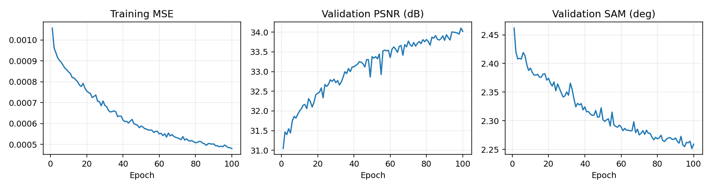
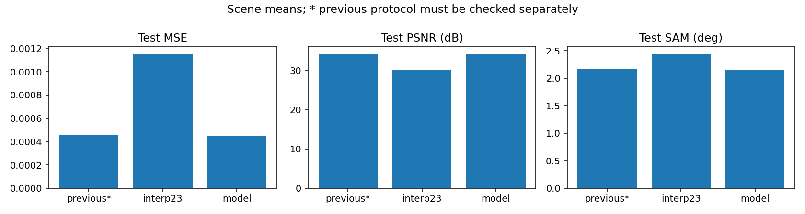
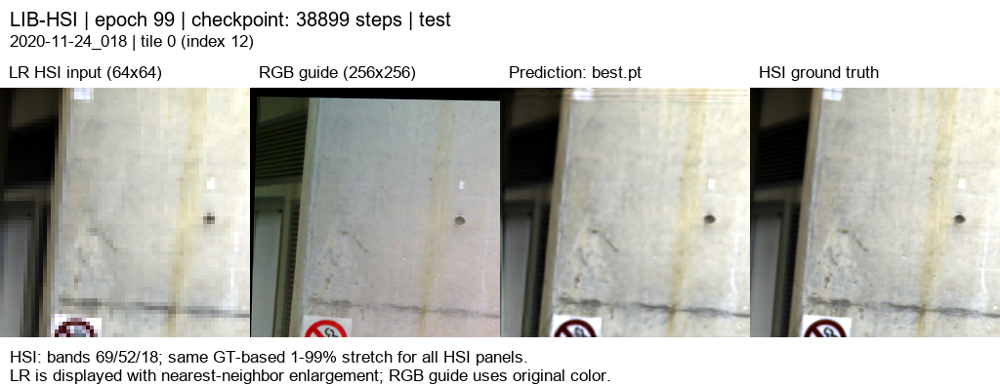

# RGB 07 · 17특징 공동 디코더와 LR 평균 일관성 학습

[현재 연구](../../../README.md) · [이전 실험](../../previous_experiments.md)

| 비교 기준 | 이번에 바꾼 점 | 관측된 차이 | 판단 |
|---|---|---|---|
| RGB06 + LR 보정 | RGB별 출력을 공동 디코더로 결합 | PSNR +0.0658 dB / SAM −0.0055° | 17특징·공동 디코더를 후속 기본 구조로 사용했습니다. |

[수치](#3-정량-결과) · [이전 대비](#4-직전-연구와-수치-차이) · [그래프](#5-그래프) · [결과 이미지](#6-결과-이미지-예시)

## 1. 목적과 상태

R/G/B별 17특징을 합쳐 204밴드를 공동 복원하고, 출력의 4×4 평균을 LR HSI 입력과 맞춘 **예측값으로 학습**했습니다. run `20261005-061505-8be6241e5a6c`은 2026-10-05 11:26(KST) 종료 코드 0으로 100/100에폭을 완료했습니다. 검증 MSE가 가장 낮은 99에폭 가중치를 보류된 전체 테스트에 사용했습니다. 이 결과는 LIB-HSI의 합성 ×4 축소 복원이며 실제 센서의 HR-HSI 정답 평가가 아닙니다.

## 2. 변경 사항과 평가 조건

직전 RGB06은 세 경로를 각각 204밴드로 디코딩한 다음 밴드별로 합쳤고, 학습이 끝난 출력에 LR 보정을 적용했습니다. 이번에는 R/G/B 경로의 17특징씩 총 51개를 결합하고, 1×1 혼합·3×3 공간 연산·1×1 출력의 **공동 디코더**가 204밴드 보정량을 만듭니다. 23탭 보간 HSI에 이 보정량을 더합니다. 학습 손실을 계산하기 전 예측에 LR 평균 보정을 적용하며, 검증·테스트·이미지·밴드 뷰어에도 같은 보정을 사용했습니다. 정합 마스크의 16픽셀이 모두 유효한 4×4 블록만 맞춥니다.

LIB-HSI 204밴드, HR256/LR64, `area` 합성 축소, 23탭 입력 보간과 내부 확대, K=4, 17특징, 2,616,274개 파라미터, 393/45/75개 독립 장면 학습/검증/테스트, 학습 `quadrants`·평가 `tiles`(테스트 4타일/장면), seed42, 동일 정합 manifest SHA-256 `7a66ad28bc78fe8691fddbc2d94f0a871d7c10507407f7d1f36abe1b20f004f4`를 사용했습니다. 손실은 정합 마스크 MSE + 0.01 × 분광 코사인 손실입니다. 분광 항은 GT·예측 norm >1e−6인 픽셀만 포함합니다. 0.01은 이전 설정을 유지한 값이며 최적값 검증은 아닙니다.

## 3. 정량 결과

| test 75장면 평균 · 300타일 | MSE ↓ | PSNR dB ↑ | SAM ° ↓ |
|---|---:|---:|---:|
| 23탭 기준선 + LR 보정 | 0.0011539606 | 30.0649 | 2.4450 |
| 직전 RGB06 + LR 보정 | 0.0004559785 | 34.2173 | 2.1625 |
| **현재 공동 디코더 + LR 보정** | **0.0004482036** | **34.2831** | **2.1570** |

장면별 유효 영역의 204밴드 MSE에서 PSNR(range=1)을 계산한 뒤 장면 평균을 냈습니다. 출력은 지표 전에 자르지 않았습니다. SAM은 정답 스펙트럼의 norm이 1e−6보다 큰 유효 픽셀에서 계산했습니다. 300타일은 독립 장면 75개의 분할이며 독립 표본 300개로 해석하지 않습니다. [전체·장면별 테스트 JSON](../../../experiments/results/rgb07_joint17_consistency/test_metrics.json)을 보관했습니다.

## 4. 직전 연구와 수치 차이

| 지표 | 직전 RGB06 + LR 보정 | 이번 실험 | 현재 − 직전 |
|---|---:|---:|---:|
| MSE ↓ | 0.0004559785 | 0.0004482036 | −0.000007775 |
| PSNR dB ↑ | 34.2173 | 34.2831 | +0.0658 |
| SAM ° ↓ | 2.1625 | 2.1570 | −0.0055 |

테스트 장면 ID 75개가 모두 일치하고 같은 `area` 축소, 256타일, 정합 유효 마스크, 23탭 기준선을 사용했습니다. 장면별 PSNR·MSE 개선은 **44/75**, SAM 개선은 **51/75**입니다. 평균 개선은 작으며 모든 장면에 적용되는 이득이 아닙니다. 직전과 비교해 공동 디코더와 **학습 중 보정 적용**이 함께 달라졌으므로 개선의 원인을 각각 분리해 주장할 수 없습니다. [차이 계산 JSON](../../../experiments/results/rgb07_joint17_consistency/comparison_summary.json)을 남겼습니다.

## 5. 그래프

그래프의 곡선은 [실제 에폭 기록](../../../experiments/results/rgb07_joint17_consistency/curves.json)으로 생성했습니다. 테스트 그래프의 `previous*`는 RGB06의 **LR 보정 후** 출력입니다.

## 6. 결과 이미지 예시

테스트 수치를 보기 전에 고정한 seed `20261003`, 서로 다른 장면 인덱스 `[3, 0, 43, 18, 63]`, 각 장면의 tile0입니다. 장면 ID는 순서대로 `2020-11-24_018`, `2020-11-20_017`, `2020-12-17_010`, `2020-11-26_038`, `2021-01-07_021`입니다. 왼쪽부터 **LR HSI · RGB 입력 · 예측 · 정답**입니다. HSI 패널은 69/52/18번 밴드의 정답 기반 1~99% 대비를 공통 사용하며 정량 계산은 원래 204밴드 값입니다.

204밴드는 [RGB07 보존 HTML](../../assets/rgb07_joint17_consistency/band_viewer/index.html)에서 확인합니다. 공개 Pages는 최신 대표 연구인 RGB11을 표시하며, 이전 실험 HTML은 실험별 assets에 보존합니다.

## 7. 가중치와 검증 근거

- [체크포인트 메타데이터](../../../experiments/results/rgb07_joint17_consistency/checkpoint_metadata.json): 서버 best epoch99, SHA-256 `5e126b17f0d95f445e8226fce401d0891593b245b737e73dc2810a3e4510d704`; latest epoch100, SHA-256 `f9444ed45ad099acaa68e477b9938e0803278f1fd7d05e42f0b4b3cf2a21863c`. `.pt` 파일은 서버에만 보존합니다.
- [전체 평가 완료 manifest](../../../experiments/results/rgb07_joint17_consistency/report_manifest.json), [테스트 장면별 지표](../../../experiments/results/rgb07_joint17_consistency/test_metrics.json), [고정 5장면 선택](../../../experiments/results/rgb07_joint17_consistency/selection.json), [100에폭 기록](../../../experiments/results/rgb07_joint17_consistency/curves.json), [204밴드 뷰어 메타데이터](../../../experiments/results/rgb07_joint17_consistency/band_viewer_manifest.json).
- [기존 RGB06과 동일한 정합 manifest](../../../experiments/results/rgb06_lr_consistency/alignment_manifest.json)와 [서버에 전송한 소스 파일 해시](../../../experiments/results/rgb07_joint17_consistency/source_sha256.json)를 보존했습니다. 학습 당시 코드 상태는 커밋 ID만으로 대신하지 않고 이 파일별 해시로도 확인합니다.

## 8. 한계와 다음 판단

이 실험은 합성 축소에서만 고해상도 정답을 이용합니다. 실제 RGB–HSI 센서 쌍에는 같은 정답이 없고 축소·노이즈·정합 특성이 달라 이 수치를 그대로 적용할 수 없습니다. 0.0658 dB의 평균 상승은 작고 장면별 하락도 있으므로 시각적 선명도 향상을 단정하지 않습니다. 다음 비교에서는 공동 디코더와 학습 중 LR 보정의 기여를 각각 분리한 ablation이 필요합니다.
