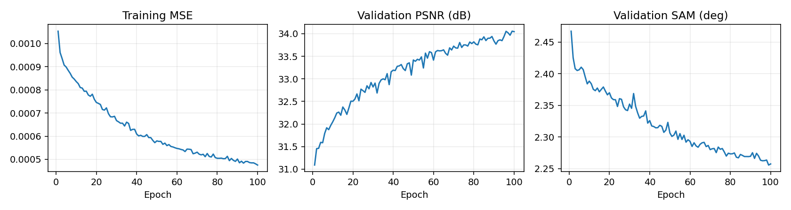
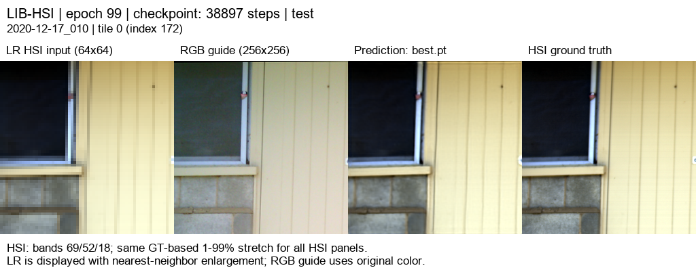

# RGB08 · 17 특징 공동 디코더 + RGB 고주파 보정

[현재 연구](../../../README.md) · [이전 연구](../../previous_experiments.md) · [후보 선정의 30 에폭 검증](../pilot/pilot_followup.md)

| 비교 기준 | 이번에 바꾼 점 | 관측된 차이 | 판단 |
|---|---|---|---|
| RGB07 | RGB 고주파 보정 경로, 전체 100에폭 | PSNR −0.0298 dB / SAM +0.0023° | 전체 학습에서 개선을 확인하지 못했습니다. |

[수치](#3-정량-결과) · [이전 대비](#4-직전-연구와-수치-차이) · [그래프](#5-그래프) · [결과 이미지](#6-결과-이미지-예시)

## 1. 목적과 상태

RGB07 에 RGB 고주파 보정 경로를 추가해 전체 데이터에서도 공간·분광 성능이 개선되는지 확인했습니다. Windows3060Ti 에서 2026-10-06 05:30–10:38(KST),100 에폭을 실행하고 exit0 으로 완료했습니다. 총 약 5 시간 8 분입니다. 검증 MSE 최소인 99 에폭을 고정한 뒤 test75 를 평가했습니다. 합성 area ×4 평가입니다.

학습 코드 commit `12206bf5803665beee8629580a51b4ce828856d7`, run `20261006-053053-ea63614f1e45`. LR1e-5 의 10 에폭 미세조정은 미실행입니다. 이번 보고서는 100 에폭 모델의 결과입니다.

## 2. 변경 사항과 평가 조건

RGB 의 평균 4 배 축소→23 탭 4 배 확대 결과를 원본 RGB 에서 빼 고주파를 추출합니다. CNN3→16→17 로 처리하고 HSI17 특징과 함께 sigmoid gate 를 계산해 반영량을 조절합니다.204 밴드로 변환한 추가 보정량을 기존 공동 디코더 출력에 더합니다. 추가 decoder 는 0 으로 초기화했습니다.2,623,454 파라미터로 RGB07 대비 7,180 개 증가했습니다.

LIB-HSI train393 / validation45 / test75,204 밴드, HR256/LR64,17 특징, K4, 학습 quadrants·평가 tiles, area 축소·23 탭, 배치 4/검증 2, seed42, LR1e-4, AMP, MSE+0.01(1−cos), 동일 정합·유효 마스크 및 학습/평가 LR 평균 보정입니다. RGB07 체크포인트의 주요 학습 설정 27 개·정합 해시·분할 수와 일치함을 확인했습니다. test75 장면의 300 타일을 평가하고 장면별 평균을 보고합니다. PSNR range=1, 전체 204 밴드를 계산했습니다.

## 3. 정량 결과

| test75 장면 ·300 타일 | MSE ↓ | PSNR dB ↑ | SAM ° ↓ | gradient RMSE ↓ |
|---|---:|---:|---:|---:|
|23 탭+LR 보정 기준선|0.0011539606|30.0649|2.44504|0.027708|
|RGB07 공동 디코더+LR 보정|0.0004482035|34.2831|2.15698|0.020658|
|RGB08 고주파 보정+LR 보정|0.0004508862|34.2533|2.15932|0.020708|

RGB07 도 같은 evaluator·GPU 환경에서 재평가해 gradient 지표를 확보했습니다. 기존 공개 RGB07 숫자와의 작은 부동소수점 차이는 PSNR 약 0.000002dB 수준입니다. [전체 및 장면별 test 지표](../../../experiments/results/rgb08_gated_detail/test_metrics.json), [동일 환경 RGB07 지표](../../../experiments/results/rgb08_gated_detail/rgb07_matched_test_metrics.json).

best99 validation 은 MSE0.0004978421, PSNR34.0558dB, SAM2.25554°, gradient0.021601 입니다. test 성능으로 best 를 고르지 않았습니다.

## 4. 직전 연구와 수치 차이

RGB08−RGB07: **PSNR−0.02986dB, SAM+0.00235°, MSE+0.0000026828(+0.60%), gradient RMSE+0.00005007**로 평균 지표가 모두 조금 악화됐습니다. PSNR38/75 장면 개선·37/75 하락, SAM31/75 개선·44/75 하락, gradient34/75 개선·41/75 하락입니다. [비교 계산과 분할 확인](../../../experiments/results/rgb08_gated_detail/comparison_summary.json).

train155·30 에폭에서는 PSNR+0.03560dB 였지만 전체 train393·100 에폭에서 그 이득이 유지되지 않았습니다. 데이터 규모와 학습량이 달라 pilot 수치와 test 수치를 직접 빼지 않습니다. 이번 전체 결과만으로 고주파 경로를 성능 개선안으로 채택하지 않습니다.

## 5. 그래프

그래프의 previous 는 기존 RGB07 입니다. [100 개 실제 epoch 기록](../../../experiments/results/rgb08_gated_detail/curves.json).

## 6. 결과 이미지 예시

결과를 보기 전에 seed20261003 으로 정한 서로 다른 test 장면 5 개, 인덱스[3,0,43,18,63], 각 tile0 입니다. 순서와 ID 는 [selection](../../../experiments/results/rgb08_gated_detail/selection.json)에 보관합니다. RGB07 과 같은 선택입니다. 왼쪽부터 **LR HSI·RGB 입력·예측·정답**입니다. HSI 표시에는 0-based 밴드 69/52/18 을 사용하며 동일한 정답 기반 1–99% 대비를 적용했습니다. LR 은 최근접 확대 표시이고 지표는 원래 204 밴드 값에서 계산합니다.

**예시 1 · `2020-11-24_018` ·tile0**

**예시 2 · `2020-11-20_017` ·tile0**

**예시 3 · `2020-12-17_010` ·tile0**

**예시 4 · `2020-11-26_038` ·tile0**

**예시 5 · `2021-01-07_021` ·tile0**

[204 밴드 HTML 뷰어](../../assets/rgb08_gated_detail/band_viewer/index.html)는 HTML 파일을 다운로드해 브라우저에서 열면 오프라인에서도 사용할 수 있습니다. 슬라이더로 모든밴드의 LR·예측·정답을 확인합니다. 뷰어는 동일한 best99 가중치를 CPU float32 로 추론하며 test 수치는 GPU AMP 에서 측정했습니다. 표시용 8 비트 PNG 는 평가 원본을 대신하지 않습니다.

## 7. 가중치와 검증 근거

Windows run 경로: `C:\CtrS-rgb-detail\SSA-MRN\experiments\checkpoints\remote-runs-detail\20261006-053053-ea63614f1e45`. best99/latest100 및 원시 로그는 서버에 보존했습니다. 전체 결과·HTML 은 `C:\CtrS-rgb-detail\SSA-MRN\experiments\results\rgb08_gated_detail`입니다.

best99 SHA256: `8410d20227f7a7db793f2d59fe90896c7eefe089e09e5d53a924c9032820ef99`.

latest100 SHA256: `e1092958faef4497174d7847ca220d790ded02766a65b77c7857de4d5eab8444`.

[체크포인트 설정·해시](../../../experiments/results/rgb08_gated_detail/checkpoint_metadata.json), [완료상태 exit0](../../../experiments/results/rgb08_gated_detail/run_state.json), [report manifest](../../../experiments/results/rgb08_gated_detail/report_manifest.json), [평가 소스해시](../../../experiments/results/rgb08_gated_detail/source_sha256.json)를 보관했습니다. test75 장면 ID·평가조건·23 탭 기준선 수치가 RGB07 과 일치하고,5 개 이미지·HTML 의 epoch·가중치 해시·장면 ID 를 확인했습니다. 데이터·pt 는 Git 에 포함하지 않습니다.

## 8. 한계와 다음 판단

이번 고주파 경로는 전체 데이터에서 평균 개선이 확인되지 않았으므로 기존 RGB07 을 기준 모델로 유지합니다. 육안으로 더 선명해 보이는 일부 장면을 평균 개선의 근거로 쓰지 않습니다. 단일 seed 이며 구조 추가에 따라 난수 소비가 달라져 작은 차이를 한 연산만의 효과로 확정할 수 없습니다.

낮은 학습률 미세조정 10 에폭은 준비됐지만 실행하지 않았습니다. 후속 진행 시 validation 으로만 전후를 선택하고, 이미 확인한 test75 숫자를 기준으로 설정을 조정하지 않습니다. 이번 보고서의 test 가 최초 검증되지 않은 새 holdout 이라고 후속 실험에서 주장하지 않습니다. 합성 area 조건의 결과이며 실제 센서 HR-HSI 정답 성능으로 해석하지 않습니다.
