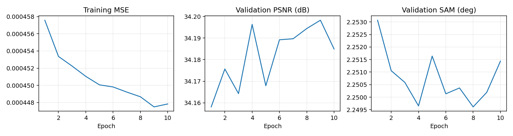
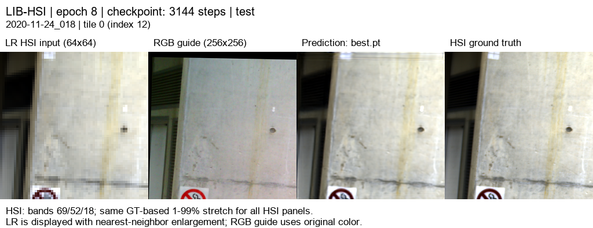
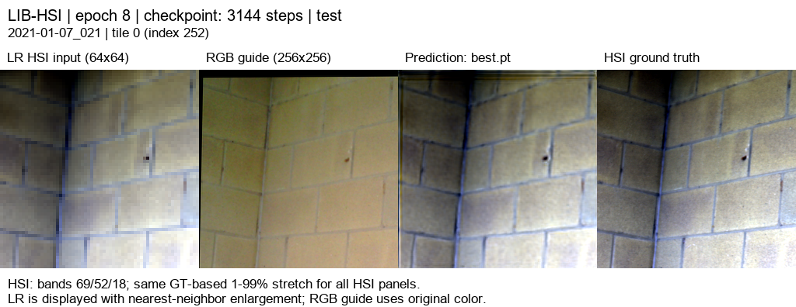

# RGB09 · RGB08 저학습률 추가 학습

[현재 연구](../../../README.md) · [이전 실험](../../previous_experiments.md) · [시작 모델 RGB08](rgb08_gated_detail.md)

| 비교 기준 | 이번에 바꾼 점 | 관측된 차이 | 판단 |
|---|---|---|---|
| RGB08 | 학습률 1e−5로 10에폭 추가 학습 | PSNR +0.1396 dB / SAM −0.0061° | 저학습률 이득과 구조 이득을 분리할 대조군이 필요했습니다. |

[수치](#3-정량-결과) · [이전 대비](#4-직전-연구와-수치-차이) · [그래프](#5-그래프) · [결과 이미지](#6-결과-이미지-예시)

## 1. 목적과 상태

RGB08의 best 99에폭 가중치에서 학습률을 `1e-4 → 1e-5`로 낮춰 10에폭을 추가 학습했습니다. 2026-10-06 15:16:11–15:47:37(KST), 약 31분 26초이며 exit 0으로 완료했습니다. 검증 MSE가 최소인 **추가 학습 8에폭**을 선택하고 전체 test 75장면을 평가했습니다. 최종 10에폭 가중치와 선택된 best를 함께 보존했습니다.

## 2. 변경 사항과 평가 조건

모델은 RGB08과 동일합니다. R/G/B별 17특징, K=4의 독립 SSA-MRN core, 공동 디코더, RGB 고주파 보정과 LR 평균 일관성 보정을 사용합니다. 2,623,454파라미터입니다.

학습률과 학습 구간만 바꾸고 **모델 가중치만 로드하여 Adam 상태·에폭·best 점수를 초기화**했습니다. 따라서 optimizer까지 이어받는 resume 실험과는 구분합니다. LIB-HSI train 393 / validation 45 / test 75, 204밴드, HR 256/LR 64, area ×4 축소, 23탭 보간, 학습 quadrants·평가 tiles, 배치 4/검증 2, seed 42, AMP, MSE + 0.01(1−cos), 정합 유효 마스크를 유지했습니다. Windows RTX 3060 Ti에서 실행했습니다.

평가는 RGB08과 동일한 75장면의 300타일이며 장면별 평균을 보고합니다. PSNR range=1, 모든 204밴드를 사용합니다. 테스트 장면 ID·정합 마스킹·평가 조건·23탭 기준선 수치 일치를 확인했습니다. best 선택에는 validation만 사용했습니다.

## 3. 정량 결과

| test 75장면 · 300타일 | MSE ↓ | PSNR dB ↑ | SAM ° ↓ | gradient RMSE ↓ |
|---|---:|---:|---:|---:|
| 23탭 + LR 보정 | 0.0011539606 | 30.0649 | 2.44504 | 0.027708 |
| RGB07 공동 디코더 | 0.0004482035 | 34.2831 | 2.15698 | 0.020658 |
| RGB08 고주파 보정 | 0.0004508862 | 34.2533 | 2.15932 | 0.020708 |
| **RGB09 추가 학습** | **0.0004371593** | **34.3929** | **2.15321** | **0.020508** |

best 8에폭의 validation: MSE **0.0004850071**, PSNR **34.1944 dB**, SAM **2.24961°**. [전체·장면별 test 지표](../../../experiments/results/rgb09_detail_finetune/test_metrics.json).

## 4. 직전 연구와 수치 차이

RGB08 대비 **PSNR +0.13959 dB, SAM −0.00612°, MSE −0.0000137270(−3.04%)**, gradient RMSE −0.00020003입니다. PSNR은 70/75장면, SAM은 68/75장면, gradient는 69/75장면에서 개선됐습니다.

RGB07 대비 PSNR +0.10973 dB, SAM −0.00377°, MSE 약 −2.46%입니다. 다만 RGB07에는 동일한 저학습률 추가 학습을 적용하지 않았으므로, 이 차이를 고주파 경로 자체의 이득으로 해석할 수 없습니다. [장면별 개선 수와 차이 계산](../../../experiments/results/rgb09_detail_finetune/comparison_summary.json).

## 5. 그래프

그래프의 previous는 RGB08입니다. [10개 실제 에폭 기록](../../../experiments/results/rgb09_detail_finetune/curves.json). 기존 100에폭 곡선은 [RGB08 보고서](rgb08_gated_detail.md)에 남겼습니다.

## 6. 결과 이미지 예시

이전 실험과 동일하게 seed 20261003, 장면 인덱스 [3, 0, 43, 18, 63]의 tile 0을 사용했습니다. 결과 수치를 보고 예시를 바꾸지 않았습니다. 왼쪽부터 **LR HSI · RGB 입력 · RGB09 예측 · 정답**입니다. HSI는 0-based 밴드 69/52/18을 정답 기반 1–99% 대비로 표시합니다. HSI 패널끼리 동일 대비이며 LR은 최근접 확대 표시입니다. 지표는 표시 이미지가 아닌 204밴드 원래 값으로 계산합니다.

**예시 1 · `2020-11-24_018`**

**예시 2 · `2020-11-20_017`**

**예시 3 · `2020-12-17_010`**

**예시 4 · `2020-11-26_038`**

**예시 5 · `2021-01-07_021`**

[204밴드 오프라인 HTML](../../assets/rgb09_detail_finetune/band_viewer/index.html)을 내려받아 브라우저에서 열면 밴드별 LR·예측·정답을 확인할 수 있습니다. 뷰어는 같은 best 가중치의 CPU float32 추론이며 test 지표는 GPU AMP로 측정했습니다. 표시용 8비트 PNG는 평가 원본을 대신하지 않습니다.

## 7. 가중치와 검증 근거

학습 코드 commit: `12206bf5803665beee8629580a51b4ce828856d7`. Run: `20261006-151610-73df9f50bf61`. 서버의 `C:\CtrS-rgb-detail\SSA-MRN\experiments\checkpoints\remote-runs-detail\20261006-151610-73df9f50bf61`에 원본 가중치와 로그를 보존했습니다.

요청에 따라 다음 세 가중치를 Git에도 보관합니다. 각 파일은 약 22MB입니다.

- [best.pt · 추가 8에폭](../../../experiments/checkpoints/rgb09_detail_finetune/best.pt)
- [latest.pt · 추가 10에폭](../../../experiments/checkpoints/rgb09_detail_finetune/latest.pt)
- [init-source.pt · 시작한 RGB08 best 99에폭](../../../experiments/checkpoints/rgb09_detail_finetune/init-source.pt)
- [세 파일의 SHA-256](../../../experiments/checkpoints/rgb09_detail_finetune/sha256.json)

best SHA-256: `0b5e1d32c9369fe9d40057c43aff54267ed5eef05ade56fe17ccb4391d5d2884`.

[완료 상태](../../../experiments/results/rgb09_detail_finetune/run_state.json), [설정·가중치 메타데이터](../../../experiments/results/rgb09_detail_finetune/checkpoint_metadata.json), [report manifest](../../../experiments/results/rgb09_detail_finetune/report_manifest.json), [평가 소스 해시](../../../experiments/results/rgb09_detail_finetune/source_sha256.json), [예시 선택](../../../experiments/results/rgb09_detail_finetune/selection.json)을 보관했습니다. 5개 이미지와 HTML의 에폭·장면 ID·가중치 해시를 확인했습니다. 원본 데이터는 Git에 넣지 않습니다.

## 8. 한계와 다음 판단

이번 가중치는 RGB08보다 평균 성능이 개선되어 최신 결과로 보관합니다. 모든 장면이 개선된 것은 아니며, 작은 SAM 차이와 단일 seed 결과를 일반적인 성능 향상으로 확정하지 않습니다.

저학습률 추가 학습 효과와 구조 효과를 구분하려면 RGB07에도 같은 10에폭 추가 학습을 적용해 validation에서 비교하는 것이 다음 대조 실험입니다. 반복해서 본 test 75를 설정 선택에 사용하지 않습니다. 이번 결과는 관측 HSI를 합성 축소한 평가이며 실제 센서 HR-HSI 정답 성능은 아닙니다. 이 실험의 HTML은 위 오프라인 링크에 보존합니다. 공개 Pages는 최신 대표 연구인 RGB11을 표시합니다.
