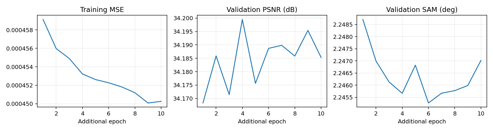

# RGB10 · RGB07 저학습률 대조 실험

[현재 연구](../../../README.md) · [RGB07](rgb07_joint17_consistency.md) · [RGB09](rgb09_detail_finetune.md)

| 비교 기준 | 이번에 바꾼 점 | 관측된 차이 | 판단 |
|---|---|---|---|
| RGB09 · 검증 데이터 비교 | 고주파 경로 없는 RGB07도 같은 저학습률 추가 학습 | 검증 PSNR +0.00507 dB / SAM −0.00395° | 단순한 RGB07 계열을 후속 실험의 시작점으로 선택했습니다. |

[수치](#3-정량-결과) · [이전 대비](#4-직전-연구와-수치-차이) · [그래프](#5-그래프) · [결과 이미지](#6-결과-이미지-예시)

## 1. 목적과 상태

고주파 경로의 이득과 저학습률 추가 학습의 효과를 비교하기 위해 RGB07에도 1e-5로 10에폭 추가 학습했습니다. 2026-10-06 16:06:26–16:37:37(KST), exit0으로 완료했습니다. 검증 MSE 최소인 추가 4에폭을 선택했습니다. test는 선택에 사용하거나 별도로 평가하지 않았습니다.

## 2. 변경 사항과 평가 조건

RGB07 best99의 가중치만 로드하고 Adam·에폭·best 점수를 초기화했습니다. 전체 train393/validation45, 204밴드, HR256/LR64, K4·17특징·공동 디코더, area×4·23탭, MSE+0.01 분광 손실, LR 보정·정합 마스크·배치·seed42를 유지했습니다. RGB09와 주요 학습 조건 24개를 비교했습니다. 고주파 경로는 없는 모델입니다.

## 3. 정량 결과

validation45 장면 평균입니다.

| 모델 | MSE ↓ | PSNR dB ↑ | SAM ° ↓ |
|---|---:|---:|---:|
| RGB07 원래 best99 · 같은 평가 프로토콜의 재평가 | 0.0004934323 | 34.1022 | 2.25140 |
| RGB09 추가 학습 | 0.0004850071 | 34.1944 | 2.24961 |
| RGB10 · RGB07 추가 학습 | 0.0004847384 | 34.1995 | 2.24567 |

첫 행은 [기존 matched 검증](../pilot/pilot_followup.md)의 Linux 재평가 수치이므로 장치 차이도 함께 고려합니다. [전체·장면별 검증과 10개 에폭](../../../experiments/results/rgb10_warm07_control/validation_results.json).

## 4. 직전 연구와 수치 차이

동일 Windows 평가 조건의 RGB09 대비 PSNR +0.00507dB, SAM −0.00395°, MSE −0.0000002687입니다. 더 단순한 RGB07의 검증 수치가 조금 더 좋았지만 차이가 작고 단일 seed입니다. RGB09의 test 숫자와 이 validation 숫자를 직접 비교하지 않습니다.

## 5. 그래프

## 6. 결과 이미지 예시

이 실험은 다음 모델의 기반을 고르는 검증 전용 비교입니다. test 평가·test5종 이미지는 생성하지 않았습니다. 경계 손실 후속 실험의 선택 모델에서 전체 test와 고정5종 이미지를 생성했습니다.

## 7. 가중치와 검증 근거

Run `20261006-160625-01cb8ea06a54`, 서버 `C:\CtrS-rgb-detail\SSA-MRN\experiments\checkpoints\remote-runs-warm07`의 해당 run에 best/latest를 보존했습니다. best 추가4에폭 SHA-256: `025101836f8f69b9d9fa20bbbcadae2a8d46667dfedbe78494817d21c677cffd`. 시작 RGB07 SHA-256: `5e126b17f0d95f445e8226fce401d0891593b245b737e73dc2810a3e4510d704`. 학습 checkout 기준은 `12206bf5803665beee8629580a51b4ce828856d7`의 모델·학습 코드이며, 당시 별도 warm 컨트롤러를 추가했습니다. [시작 상태 기록](../../../experiments/results/rgb10_warm07_control/start_state.json)을 보관했습니다.

## 8. 한계와 다음 판단

검증 비교에서 고주파 경로의 뚜렷한 이득이 확인되지 않아 RGB07을 경계 손실 실험의 기반으로 사용했습니다. 한 번의 비교로 구조의 우열을 확정하지 않습니다. 합성 축소 결과이며 실제 센서 HR-HSI 정답 성능이 아닙니다.
