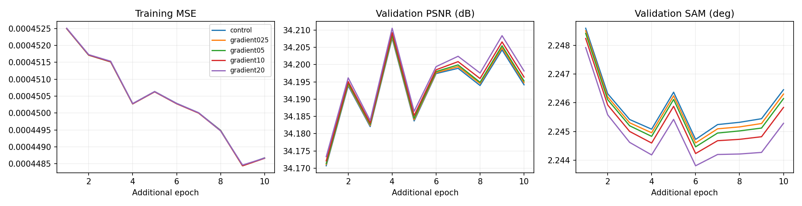
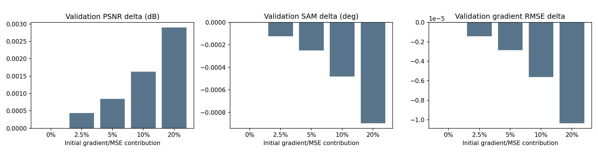
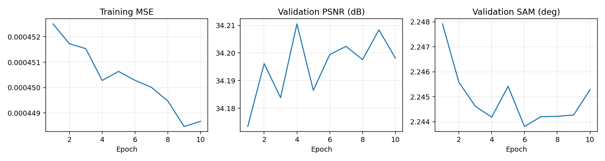
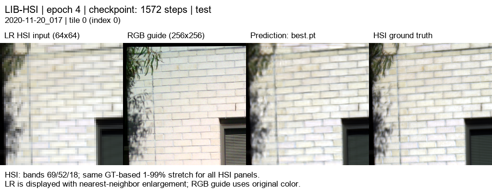
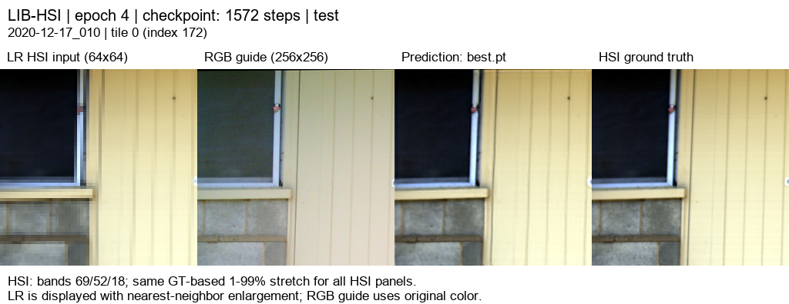
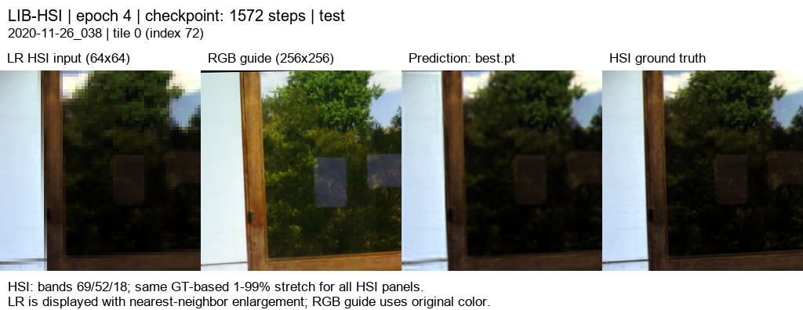
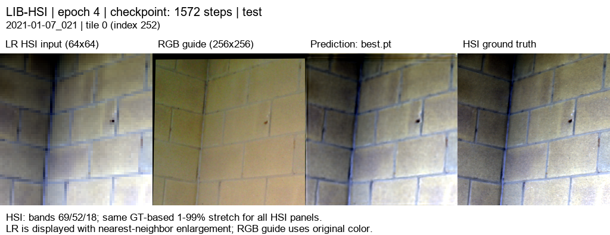

# RGB11 · HSI 경계 손실 5종 비교

[현재 연구](../../../README.md) · [이전 실험](../../previous_experiments.md) · [시작 모델의 대조 실험](rgb10_warm07_control.md)

| 비교 기준 | 이번에 바꾼 점 | 관측된 차이 | 판단 |
|---|---|---|---|
| 같은 시작 가중치·학습량의 대조군 | HSI 경계 손실 4개 강도와 대조군 비교 | test PSNR +0.003158 dB / SAM −0.000849° | 검증으로 선택한 20% 후보의 이득은 작습니다. RGB09보다 MSE는 높습니다. |

[수치](#3-정량-결과) · [이전 대비](#4-직전-연구와-수치-차이) · [그래프](#5-그래프) · [결과 이미지](#6-결과-이미지-예시)

## 1. 목적과 상태

HSI 경계 변화량을 맞추는 손실이 흐릿함을 줄이는지 확인했습니다. Windows RTX 3060 Ti에서 2026-10-06 16:44–19:21(KST)에 대조군과 네 강도를 순차 학습했습니다. 모두 10에폭·exit 0으로 완료했으며 총 약 2시간 37분입니다.

전체 validation 45장면의 평균 MSE로 20% 설정을 선택한 뒤, 선택 모델과 같은 학습량의 대조군만 test 75장면에서 평가했습니다. 나머지 강도는 test로 평가하거나 선택하지 않았습니다.

## 2. 변경 사항과 평가 조건

RGB07의 저학습률 추가 학습에서 선택한 best 추가 4에폭을 공통 시작 가중치로 사용했습니다. 각 실험은 모델 가중치만 로드하고 Adam·에폭·best 점수를 초기화해 LR 1e-5로 10에폭을 학습했습니다. 시작 SHA-256은 `025101836f8f69b9d9fa20bbbcadae2a8d46667dfedbe78494817d21c677cffd`입니다.

구조는 고주파 경로가 없는 RGB07: R/G/B별 17특징·K=4 독립 core·공동 디코더, 2,616,274파라미터입니다. LIB-HSI train 393 / validation 45 / test 75, 204밴드, HR256/LR64, area ×4, 23탭, quadrants/tiles, 배치 4/검증 2, seed42, AMP, 정합 마스크와 LR 평균 보정을 유지했습니다.

손실은 MSE + 0.01 × 분광 코사인 손실 + λg × **HSI gradient L1**입니다. gradient 항은 가로·세로 인접 픽셀 사이의 변화량이 예측과 정답에서 일치하도록 합니다. 양쪽 픽셀이 모두 유효한 쌍만 포함하고 타일 경계를 가로질러 계산하지 않습니다. 전체 밴드·유효한 쌍의 수로 평균을 냅니다.

학습 장면 인덱스 [0,56,112,168,224,280,336,392]의 네 타일씩 총 32타일에서 시작 가중치의 MSE와 gradient 항을 측정했습니다. 초기 기여가 MSE의 0/2.5/5/10/20%가 되도록 λg를 정한 뒤 고정했습니다. 이는 초기 보정 비율이며 학습 중 기여 비율은 달라집니다. 선택 설정 λg = **0.006851497328160879**입니다. 검증·test는 강도 보정에 사용하지 않았습니다.

## 3. 정량 결과

**검증 45장면 / 180타일**의 best 결과입니다. 모든 best는 추가 4에폭이며 최대 PSNR 에폭을 따로 고르지 않았습니다.

| 초기 경계 손실 기여 | best 추가 에폭 | MSE ↓ | PSNR dB ↑ | SAM ° ↓ | gradient RMSE ↓ |
|---|---:|---:|---:|---:|---:|
| 0% · 대조군 | 4 | 0.0004837964 | 34.207613 | 2.245079 | 0.02140527 |
| 2.5% | 4 | 0.0004837661 | 34.208050 | 2.244954 | 0.02140385 |
| 5% | 4 | 0.0004837415 | 34.208456 | 2.244829 | 0.02140241 |
| 10% | 4 | 0.0004836854 | 34.209241 | 2.244597 | 0.02139967 |
| 20% · 선택 | 4 | 0.0004836154 | 34.210515 | 2.244183 | 0.02139492 |

**선택 후 test 75장면 / 300타일**의 장면 평균입니다.

| 모델 | MSE ↓ | PSNR dB ↑ | SAM ° ↓ | gradient RMSE ↓ |
|---|---:|---:|---:|---:|
| 23탭 + LR 보정 | 0.0011539606 | 30.0649 | 2.44504 | 0.027708 |
| 동일 학습량 대조군 | 0.0004378418 | 34.3916 | 2.15071 | 0.020510 |
| 경계 손실 20% | 0.0004376169 | 34.3948 | 2.14986 | 0.020498 |
| 직전 공개 RGB09 | 0.0004371593 | 34.3929 | 2.15321 | 0.020508 |

[전체·장면별 test](../../../experiments/results/rgb11_gradient_suite/test_metrics.json), [대조군 test](../../../experiments/results/rgb11_gradient_suite/control_test_metrics.json), [다섯 실험 전체 검증·에폭 기록](../../../experiments/results/rgb11_gradient_suite/suite_results.json).

## 4. 직전 연구와 수치 차이

같은 학습량의 대조군 대비 검증 PSNR **+0.002902 dB**, SAM **−0.000896°**, MSE **−0.0000001810**(약 −0.0374%)입니다. test에서는 PSNR **+0.003158 dB**, SAM **−0.000849°**, MSE **−0.0000002249**(약 −0.0514%)입니다. 경계 손실의 평균 이득은 매우 작습니다. test에서 PSNR은 56/75장면, SAM과 gradient RMSE는 각각 70/75장면에서 개선됐습니다. [차이와 개선 장면 수](../../../experiments/results/rgb11_gradient_suite/comparison_summary.json).

직전 공개 RGB09 대비 test PSNR +0.001945 dB, SAM −0.003346°이며 **MSE는 약 0.105% 증가**했습니다. 구조와 학습 이력이 달라 이 비교로 경계 손실의 효과를 주장하지 않습니다. 장면별 PSNR 평균과 장면별 MSE 평균은 평균 순서가 달라 순위가 달라질 수 있습니다.

## 5. 그래프

마지막 그래프의 previous는 이번 대조군입니다. 차이가 작으므로 별도 검증 차이 그래프와 숫자를 함께 확인합니다.

## 6. 결과 이미지 예시

기존에 고정한 seed20261003, 서로 다른 test 장면 인덱스 [3,0,43,18,63]의 tile0을 유지했습니다. 왼쪽부터 **LR HSI · RGB 입력 · 선택 모델 예측 · 정답**입니다. HSI 표시 밴드는 0-based 69/52/18이며 정답 기반 1–99% 대비를 HSI 패널에 공통 적용했습니다. LR은 최근접 확대 표시이고 지표는 원래 204밴드 값에서 계산합니다.

**예시 1 · `2020-11-24_018`**

**예시 2 · `2020-11-20_017`**

**예시 3 · `2020-12-17_010`**

**예시 4 · `2020-11-26_038`**

**예시 5 · `2021-01-07_021`**

[204밴드 오프라인 HTML](../../assets/rgb11_gradient_suite/band_viewer/index.html)을 다운로드해 브라우저에서 열 수 있습니다. 같은 best 가중치로 CPU float32 추론하며 test 수치는 GPU AMP에서 측정했습니다. 8비트 표시 영상은 평가 원본을 대신하지 않습니다. 이 작은 수치 차이만으로 눈에 띄는 선명도 개선을 주장하지 않습니다.

## 7. 가중치와 검증 근거

서버 체크포인트는 `C:\CtrS-rgb-detail\SSA-MRN\experiments\checkpoints\remote-runs-warm07` 아래 run별 best/latest로 보존합니다. 다섯 run 경로·해시는 suite JSON에 있습니다. 선택 run은 `20261006-185005-71b1426e91d5`, best 추가 4에폭 SHA-256은 `40e6170da46633004ee292b2434898f1b1e67dcbbd9a3ecf0deef78568a65f65`입니다.

학습 checkout 기준 commit은 `12206bf5803665beee8629580a51b4ce828856d7`이며 경계 손실·실행 도구 변경은 당시 미커밋 상태였습니다. 따라서 commit만으로 실행 코드를 특정하지 않고 [실제 파일 해시](../../../experiments/results/rgb11_gradient_suite/source_sha256.json)와 [학습 소스 차이](../../../experiments/results/rgb11_gradient_suite/gradient_training_patch.diff)를 함께 보관합니다. 경계 손실 구현과 순차 실행 도구도 저장소에 남깁니다.

[report manifest](../../../experiments/results/rgb11_gradient_suite/report_manifest.json), [선택 기록](../../../experiments/results/rgb11_gradient_suite/selection.json), [가중치 설정·해시](../../../experiments/results/rgb11_gradient_suite/checkpoint_metadata.json)를 보관했습니다. 전체 test 장면 ID·평가 조건·기준선 일치와 이미지/HTML의 epoch·장면·해시를 확인했습니다. 원본 데이터는 수정하지 않았습니다.

## 8. 한계와 다음 판단

20% 설정은 이번 검증 범위에서 가장 좋았지만 이득이 작고 단일 seed입니다. 작은 경계 손실을 적용한 후보로 보관하며, 확실한 성능 개선이나 시각적 선명도 향상으로 확정하지 않습니다. 강도 범위의 끝이 best라는 이유만으로 더 큰 값을 계속 시험하지 않습니다.

PSNR·SAM·gradient의 장면별 변화를 검토한 뒤 추가 변경 여부를 판단합니다. 반복해서 본 test는 후속 설정 선택에 사용하지 않습니다. 합성 area ×4 평가이며 실제 센서 HR-HSI 정답 성능이 아닙니다. [공개 204밴드 뷰어](https://biyonghiyon.github.io/RGB-HSI-SR/ssa-mrn/)에는 이 RGB11 결과를 표시합니다. 이전 실험 HTML은 각 보고서에서 오프라인으로 확인합니다.
