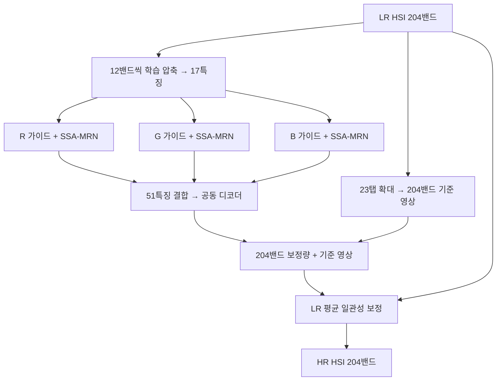

# 연구 설명 · RGB 유도 HSI 초해상도

[최신 결과](../README.md) · [재현 연구](reproduction.md) · [이전 실험](previous_experiments.md)

고해상도 RGB의 공간 구조와 저해상도 HSI의 분광 관측값을 결합해, 공간 크기가 4배인 **204밴드 HSI**를 복원합니다. 현재 대표 결과는 RGB11입니다. 실험별 숫자와 변경 이력은 개별 보고서에 두고, 이 문서는 현재 알고리즘과 평가의 의미를 설명합니다.

## 입력과 평가 범위

| 항목 | 현재 RGB–HSI 조건 |
|---|---|
| 데이터 | LIB-HSI, RGB–HSI 513장면, HSI 204밴드 |
| 독립 장면 분할 | 학습 393 / 검증 45 / 시험 75 |
| 공간 크기 | 512×512 장면을 256×256 타일 4개로 분할 |
| 모델 입력 | RGB 3×256×256, HSI 204×64×64 |
| 출력과 정답 | HSI 204×256×256 |
| 축소 / 초기 확대 | area ×4 / 23탭 보간 |
| 평가 | 장면별 지표를 계산한 뒤 평균, 정합 유효 영역 사용 |

관측 HSI를 정답으로 두고 평균 축소해 LR 입력을 만드는 **합성 축소 실험**입니다. 실제 센서의 관측 해상도보다 높은 HSI 정답은 없으므로, 실제 센서 초해상도의 정확도를 입증하는 수치가 아닙니다. 1,572개 학습 타일은 393개 장면에서 나옵니다. 인접 촬영 장면의 독립성도 별도 검증 대상입니다.

정합은 RGB를 HSI 격자에 맞추는 projective 변환을 사용합니다. HR-HSI 참조를 정합 추정에 활용했으므로 실제 LR-HSI만 있는 상황의 전처리와 차이가 있습니다. [데이터 감사](../references/rgb_hsi_datasets.md) · [정합 근거](../experiments/results/lib_registration/projective_alignment.json)

## 현재 알고리즘

1. **분광 압축:** 인접한 12밴드씩 17그룹으로 묶고, grouped 1×1 합성곱으로 17특징을 만듭니다. 각 특징은 `z = w₁h₁ + … + w₁₂h₁₂ + b`입니다. 가중치와 편향은 최종 복원 오차로 학습되며 단순 평균으로 고정되지 않습니다.
2. **RGB별 처리:** R·G·B 각각의 독립 SSA-MRN core가 17특징 전체를 처리합니다. K=4는 SSAI 내부 투영 차원으로, 17특징이나 204밴드와 다른 수입니다. 여러 공간 해상도의 특징을 결합하며 내부 축소는 평균, 확대는 23탭입니다.
3. **공동 디코더:** 세 경로의 17특징을 연결한 51특징에서 204밴드 보정량을 함께 만듭니다. 이전 RGB06은 RGB별 디코더가 각자 보정량을 만들고 융합했습니다.
4. **잔차 복원:** 204밴드 LR-HSI의 23탭 확대 영상에 보정량을 더합니다. 보간 값이 0.40, 보정량이 +0.03이면 출력은 0.43입니다. 보정량은 음수도 가능하고, 별도 보정량 정답 없이 최종 HSI와 정답의 차이로 학습합니다.
5. **LR 평균 일관성:** 출력의 각 4×4 블록 평균을 원래 LR 값과 맞춥니다. 출력 블록 평균이 0.43이고 LR 관측값이 0.40이면 블록 전체에서 0.03을 뺍니다. 블록 내부의 상대적인 세부 차이는 유지합니다. 평균 축소 가정에 맞는 보정이며 임의의 센서 축소에 그대로 적용할 수 있는 것은 아닙니다.

204밴드는 보간 경로로 그대로 전달되고, 17특징은 보정량 생성에 쓰입니다. 압축 특징에 모든 분광 정보가 손실 없이 담긴다는 뜻은 아닙니다. 학습이 끝난 뒤 테스트에서는 가중치를 고정합니다.

구현: [RGB 모델](../src/ssamrn/models/rgb_grouped.py) · [23탭](../src/ssamrn/models/interp23.py) · [학습·평가](../scripts/train_lib.py)

## 손실과 모델 선택

현재 RGB11은 유효 영역에서 다음 손실로 추가 학습했습니다.

`L = MSE + 0.01 × (1 − cos(예측 스펙트럼, 정답 스펙트럼)) + λg × 경계 L1`

| 항목 | 맞추려는 정보 |
|---|---|
| MSE | 전체 204밴드의 값 크기 |
| 분광 코사인 손실 | 픽셀별 스펙트럼의 방향·상대적인 형태 |
| 경계 L1 | 가로·세로 인접 픽셀의 변화량 |

분광 항에서는 거의 0인 스펙트럼을 제외합니다. 경계 항은 양쪽 픽셀이 모두 정합 유효 영역인 쌍만 사용합니다. λg는 학습 장면에서 초기 손실 비율을 보정하고 고정했습니다. RGB11은 0·2.5·5·10·20% 초기 기여를 비교했으며, 검증 MSE로 20% 후보를 선택했습니다. 이 비율이 학습 내내 유지되는 것은 아닙니다.

RGB07의 100에폭 학습 후 RGB10에서 저학습률 10에폭을 추가했고, 그 best에서 RGB11의 각 후보를 10에폭씩 추가 학습했습니다. 각 단계는 가중치만 가져와 optimizer를 초기화했습니다. 따라서 RGB11을 처음부터 10에폭 학습한 모델로 해석하지 않습니다. best는 검증 MSE 최소 에폭이며, test는 선택 후 보고용입니다.

## 수치와 이미지 읽기

- **MSE ↓:** 값의 제곱 오차. 낮을수록 좋습니다.
- **PSNR ↑:** 값 오차를 로그 척도로 표현합니다. 현재 data range는 1입니다.
- **SAM ↓:** 픽셀별 204밴드 벡터 사이의 각도입니다. 낮을수록 스펙트럼 방향이 가깝습니다.

장면별 PSNR을 평균하므로 평균 MSE 순위와 항상 같지는 않습니다. RGB11은 같은 타일 평가를 사용한 최근 완료 모델 중 PSNR·SAM이 가장 좋지만, RGB09보다 평균 MSE는 약 0.105% 높습니다. 경계 손실 대조군 대비 PSNR +0.0032 dB의 작은 차이를 눈에 띄는 선명도 향상으로 해석하지 않습니다.

4패널 예시는 **LR HSI · RGB 입력 · 예측 · 정답**입니다. 컬러 HSI는 선택한 세 밴드를 표시한 영상이며 전체 204밴드 성능을 대표하지 않습니다. HSI 패널에는 정답 유효 영역의 같은 대비 범위를 적용하고 수치는 대비 조정 전 값으로 계산합니다. [204밴드 웹뷰어](https://biyonghiyon.github.io/RGB-HSI-SR/ssa-mrn/)는 밴드마다 동일한 대비를 적용한 8비트 표시입니다. 파장 정보가 확인되지 않아 밴드 번호를 사용합니다.

## PAN–MS 재현과 달라진 점

| 항목 | PAN–MS 재현 | 현재 RGB–HSI |
|---|---|---|
| 가이드 | PAN 1채널 | R/G/B별 독립 경로 |
| 분광 입력 | MS 4·8밴드 | HSI 204밴드 → 학습 17특징 |
| 초기 확대 | 제공 LMS, 23탭 계열 | LR-HSI에 23탭 적용 |
| core 내부 resampling | Bilinear, align_corners=True | 평균 축소 / 23탭 확대 |
| 최종 출력 | 네트워크 HRMS 출력 | 204밴드 보간 + 공동 디코더 보정 + LR 일관성 |
| 손실 | MSE | MSE + 분광 방향 + 경계 손실 |

재현 모델에도 내부 잔차 연결이 있습니다. 차이는 확장 모델의 최종 출력에 204밴드 보간 경로와 LR 일관성을 명시적으로 둔 것입니다. 공개 SSAI의 원소별 곱·전치·softmax는 논문의 어텐션 행렬곱 설명과 같다고 주장하지 않습니다. 재현의 센서별 수치는 [재현 연구](reproduction.md)에서 확인합니다.

12특징부터 공동 디코더까지의 변경과 실패한 Bilinear·고주파 실험은 [이전 실험](previous_experiments.md)에 보존합니다. 이후 실험도 같은 보고서 양식으로 비교하며, 단일 seed와 반복해서 확인한 test의 한계를 유지합니다.
